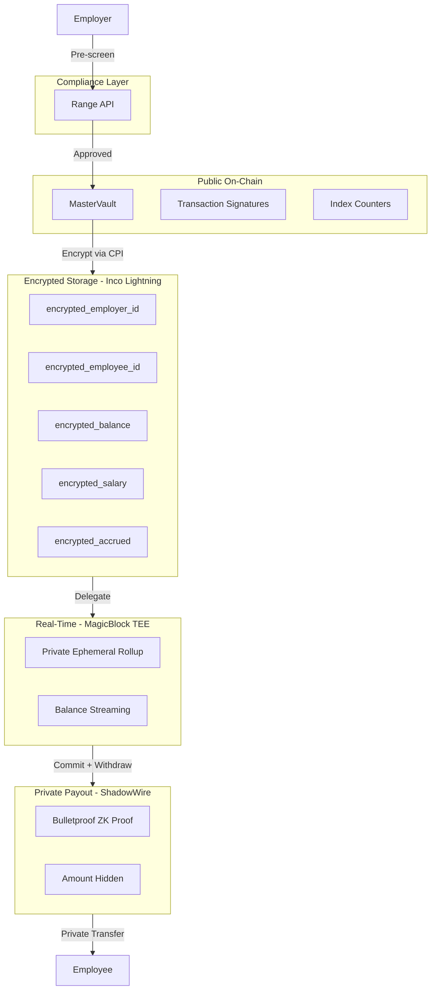

# Bagel - Privacy-First Payroll on Solana

**Bringing the $80 billion payroll market on-chain with end-to-end privacy.**

[](https://explorer.solana.com/address/J45uxvT26szuQcmxvs5NRgtAMornKM9Ga9WaQ58bKUNE?cluster=devnet)
[](https://www.anchor-lang.com/)
[](https://solana.com/privacyhack)

---

## The Problem: Glass Office Payroll

Traditional crypto payroll is **embarrassingly public**:

- **Competitors see your burn rate** - Every payment is visible on-chain
- **Colleagues see each other's salaries** - Awkward and damaging to culture
- **Zero financial privacy** - Wallet addresses linked to real identities
- **Employer-employee relationships exposed** - Anyone can map your org chart

This "Glass Office" problem prevents institutional adoption of crypto payroll. The $80B+ payroll industry cannot move on-chain until privacy is solved.

---

## The Solution: Bagel

Bagel is **privacy-preserving payroll infrastructure** for stablecoin payments on Solana. We encrypt everything from storage to payout using a 5-layer privacy stack.

### What Makes Bagel Different

| Traditional Crypto Payroll | Bagel |
|---------------------------|-------|
| Salaries visible on-chain | Salaries encrypted (Inco Lightning) |
| Employer-employee links exposed | Index-based PDAs hide relationships |
| Individual balances trackable | Single Master Vault pools all funds |
| Withdrawal amounts public | ZK proofs hide amounts (ShadowWire) |
| Batch payments only | Real-time streaming (MagicBlock TEE) |

---

## Architecture



### Privacy Stack

| Layer | Technology | Purpose | Status |
|-------|------------|---------|--------|
| Compliance | Range API | Wallet pre-screening (OFAC, risk scores) | Production |
| Infrastructure | Helius RPC | High-performance RPC + DAS API | Production |
| Encryption | Inco Lightning | FHE encrypted salaries, IDs, balances | Devnet |
| Streaming | MagicBlock PER | Real-time balance updates in TEE | Devnet |
| Payouts | ShadowWire | ZK Bulletproof amount hiding | Mainnet |

---

## Privacy Matrix

### What is Encrypted vs Public

| Data | Status | Tool | Notes |
|------|--------|------|-------|
| Employer Identity | ENCRYPTED | Inco Lightning | Hash of pubkey stored as Euint128 ciphertext |
| Employee Identity | ENCRYPTED | Inco Lightning | Hash of pubkey stored as Euint128 ciphertext |
| Salary Rate | ENCRYPTED | Inco Lightning | Per-second rate as ciphertext |
| Accrued Balance | ENCRYPTED | Inco Lightning | Employee earnings hidden |
| Business Balance | ENCRYPTED | Inco Lightning | Per-business allocation hidden |
| Business/Employee Counts | ENCRYPTED | Inco Lightning | Total counts hidden from observers |
| Real-time Balance | PRIVATE | MagicBlock TEE | Computed inside trusted enclave |
| Withdrawal Amount | HIDDEN | ShadowWire | Bulletproof ZK proof (mainnet) |
| Transfer Amounts | ✅ **ENCRYPTED** | Inco Confidential Tokens | **ENABLED** - Encrypted on-chain transfers working on devnet |
| Total Vault Balance | PUBLIC | Solana L1 | Unavoidable - but aggregated across all businesses |
| Transaction Signatures | PUBLIC | Solana L1 | Unavoidable |
| PDA Addresses | PUBLIC | Solana L1 | Index-based, NOT linked to identities |

### Privacy Model

1. **Index-Based PDAs**: No employer/employee pubkeys in PDA seeds
   - BusinessEntry: `["entry", master_vault, entry_index]`
   - EmployeeEntry: `["employee", business_entry, employee_index]`
   - Observers cannot derive relationships from addresses

2. **Single Master Vault**: All funds pool into one account
   - Observers see only aggregate balance changes
   - Cannot correlate deposits/withdrawals to specific businesses

3. **Encrypted Identities**: Pubkey hashes stored as Inco ciphertext
   - Only authorized parties can decrypt and verify

4. **Optional ZK Payouts**: ShadowWire hides withdrawal amounts on mainnet

5. **Confidential Token Transfers**: **ENABLED** - Inco Confidential SPL Tokens encrypt transfer amounts on-chain. Fully deployed and working on devnet. Transfer amounts and token account balances are encrypted as ciphertext.

---

## Program IDs

| Component | Program ID | Network |
|-----------|------------|---------|
| **Bagel** | `J45uxvT26szuQcmxvs5NRgtAMornKM9Ga9WaQ58bKUNE` | Devnet |
| Inco Lightning | `5sjEbPiqgZrYwR31ahR6Uk9wf5awoX61YGg7jExQSwaj` | Devnet |
| Inco Confidential Token | `HuUn2JwCPCLWwJ3z17m7CER73jseqsxvbcFuZN4JAw22` | Devnet |
| MagicBlock Delegation | `DELeGGvXpWV2fqJUhqcF5ZSYMS4JTLjteaAMARRSaeSh` | Devnet |
| ShadowWire | `GQBqwwoikYh7p6KEUHDUu5r9dHHXx9tMGskAPubmFPzD` | Mainnet |

### Token Mints

| Token | Mint Address | Network |
|-------|--------------|---------|
| **USDBagel** | `A3G2NBGL7xH9T6BYwVkwRGsSYxtFPdg4HSThfTmV94ht` | Devnet |

---

## Quick Start

### Prerequisites

- Rust 1.92.0+
- Solana CLI 2.0+
- Anchor CLI 0.31.1
- Node.js 18+

### Installation

```bash
# Clone the repository
git clone https://github.com/ConejoCapital/Bagel.git
cd Bagel

# Install Rust dependencies
cargo build

# Install Node dependencies
npm install

# Build the Solana program
anchor build
```

### Run E2E Test

```bash
# Run the full privacy test on devnet (SOL transfers)
node tests/test-real-privacy-onchain.mjs

# Run the confidential token test (encrypted transfers)
node test-confidential-payroll.mjs
```

**Standard Test** (`test-real-privacy-onchain.mjs`):
1. Create test wallets and fund them
2. Run Range compliance checks
3. Register businesses with encrypted IDs
4. Deposit to the Master Vault
5. Add employees with encrypted salaries
6. Process withdrawals with ShadowWire simulation
7. Output a full privacy audit report

**Confidential Token Test** (`test-confidential-payroll.mjs`):
1. Migrate vault if needed (old → new structure)
2. Configure confidential tokens
3. Execute deposit with encrypted transfer amount
4. Execute withdrawal with encrypted transfer amount
5. Verify all amounts are encrypted on-chain
6. Output complete privacy verification report

### Run Frontend

```bash
cd app
npm install
npm run dev
# Open http://localhost:3000
```

---

## Project Structure

```
Bagel/
├── programs/bagel/src/          # Solana program (Rust/Anchor)
│   ├── lib.rs                   # Maximum privacy architecture
│   ├── constants.rs             # Privacy tool program IDs
│   ├── privacy/                 # Privacy integrations
│   │   ├── inco.rs              # Inco Lightning FHE
│   │   ├── magicblock.rs        # MagicBlock PER
│   │   └── shadowwire.rs        # ShadowWire ZK
│   └── instructions/            # Instruction handlers
│
├── app/                         # Frontend (Next.js 15)
│   ├── pages/
│   │   ├── landing.tsx          # Landing page
│   │   ├── employer.tsx         # Employer dashboard
│   │   ├── employee.tsx         # Employee dashboard
│   │   └── privacy-audit.tsx    # Privacy verification
│   └── lib/
│       ├── helius.ts            # Helius RPC client
│       ├── inco.ts              # Inco encryption client
│       ├── range.ts             # Range compliance client
│       ├── magicblock.ts        # MagicBlock streaming client
│       └── shadowwire.ts        # ShadowWire ZK client
│
├── Context/                     # Integration guides (00-07)
├── docs/                        # Architecture documentation
├── docs-site/                   # Docusaurus documentation
├── tests/                       # E2E test files
└── scripts/                     # Deployment scripts
```

---

## Environment Setup

Create `app/.env.local`:

```bash
# Solana RPC (Helius recommended)
NEXT_PUBLIC_SOLANA_RPC_URL=https://devnet.helius-rpc.com/?api-key=YOUR_HELIUS_KEY
NEXT_PUBLIC_BAGEL_PROGRAM_ID=J45uxvT26szuQcmxvs5NRgtAMornKM9Ga9WaQ58bKUNE

# Privacy Tools
NEXT_PUBLIC_HELIUS_API_KEY=YOUR_HELIUS_KEY
NEXT_PUBLIC_RANGE_API_KEY=YOUR_RANGE_KEY
NEXT_PUBLIC_INCO_PROGRAM_ID=5sjEbPiqgZrYwR31ahR6Uk9wf5awoX61YGg7jExQSwaj
NEXT_PUBLIC_INCO_TOKEN_PROGRAM_ID=HuUn2JwCPCLWwJ3z17m7CER73jseqsxvbcFuZN4JAw22
NEXT_PUBLIC_MAGICBLOCK_TEE_URL=https://tee.magicblock.app
NEXT_PUBLIC_SHADOWWIRE_PROGRAM_ID=GQBqwwoikYh7p6KEUHDUu5r9dHHXx9tMGskAPubmFPzD
```

---

## How It Works

### 1. Employer Creates Payroll
- Range API pre-screens wallet for compliance
- Business registered with index-based PDA (no pubkey in seeds)
- Employer ID encrypted via Inco Lightning CPI

### 2. Funds Deposited
- Confidential USDBagel tokens transferred to single Master Vault (encrypted amount)
- Business balance updated via encrypted homomorphic addition
- Observer sees only total vault balance change
- Transfer amounts are encrypted on-chain (ciphertext, not plaintext)

### 3. Employee Added
- Employee registered with index-based PDA
- Employee ID and salary encrypted via Inco Lightning
- No link between employee wallet and PDA address

### 4. Real-Time Streaming (Optional)
- Employee entry delegated to MagicBlock TEE
- Balance computed in private ephemeral rollup
- Updates every ~10ms without on-chain transactions

### 5. Private Withdrawal
- State committed back to L1 from TEE
- Confidential token transfer with encrypted amount (devnet)
- ShadowWire ZK proof hides withdrawal amount (mainnet)
- Employee receives funds with transaction amount hidden
- Transfer amounts are encrypted on-chain (ciphertext, not plaintext)

---

## Sponsor Integrations

### Helius - RPC Infrastructure
- All transactions use Helius RPC endpoints
- DAS API for transaction fetching in privacy audit

### Range - Compliance
- Pre-screen wallets before payroll creation
- Risk score + OFAC sanctions check

### Inco - Encrypted Ledger
- FHE encryption for all sensitive data
- Homomorphic operations (add, subtract) on encrypted values

### MagicBlock - Real-Time Privacy
- Private Ephemeral Rollups for streaming payments
- TEE-based computation for live balance updates

### ShadowWire - ZK Payouts
- Bulletproof zero-knowledge proofs
- Hide withdrawal amounts on mainnet

---

## Test Results

See test result files for complete verification:
- [TEST_RESULTS_2026-01-26.md](TEST_RESULTS_2026-01-26.md) - Standard E2E test with SOL transfers
- [CONFIDENTIAL_TOKEN_TEST_RESULTS.md](CONFIDENTIAL_TOKEN_TEST_RESULTS.md) - Confidential token test with encrypted transfers

**Summary:**
- Status: ✅ PASSED
- Businesses registered: 2
- Employees added: 4
- Withdrawals successful: 4/4 (100%)
- All privacy tools integrated and verified
- **Confidential tokens: ENABLED and working**
  - Transfer amounts encrypted on-chain
  - Token account balances encrypted
  - Real on-chain transactions verified

---

## Team

- **@ConejoCapital** - Backend, Privacy Integrations, Architecture - [https://x.com/ConejoCapital]
- **@tomi204_** - Frontend, UI/UX, Documentation - [https://x.com/Tomi204_]

---

## License

MIT License - See [LICENSE](LICENSE)

---

## Links

- **GitHub**: [github.com/ConejoCapital/Bagel](https://github.com/ConejoCapital/Bagel)
- **Program Explorer**: [Solana Explorer](https://explorer.solana.com/address/J45uxvT26szuQcmxvs5NRgtAMornKM9Ga9WaQ58bKUNE?cluster=devnet)
- **Hackathon**: [Solana Privacy Hack 2026](https://solana.com/privacyhack)

---

**Simple payroll. Private paydays.**

*Built for Solana Privacy Hackathon 2026*
