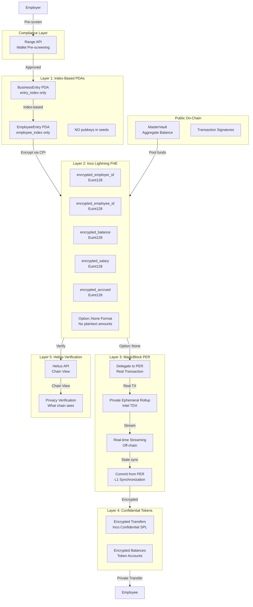

# Bagel - Privacy-First Payroll on Solana

**Bringing the $80 billion global payroll market on-chain with end-to-end privacy.**

[](https://orbmarkets.io/address/J45uxvT26szuQcmxvs5NRgtAMornKM9Ga9WaQ58bKUNE?cluster=devnet)
[](https://www.anchor-lang.com/)
[](https://solana.com/privacyhack)

---

## The Opportunity: $80 Billion Market

The global payroll industry processes **$80+ billion annually** in employee payments. Yet traditional crypto payroll solutions remain embarrassingly public—every salary, every payment, every relationship visible on-chain. This "Glass Office" problem has prevented institutional adoption.

**Bagel solves this.** We're building the infrastructure to bring enterprise payroll on-chain with **zero privacy leaks**—enabling the next generation of crypto-native companies to pay employees privately, securely, and at scale.

---

## The Problem: Glass Office Payroll

Traditional crypto payroll exposes everything:

- **Competitors see your burn rate** - Every payment visible on-chain
- **Colleagues see each other's salaries** - Damaging to company culture
- **Zero financial privacy** - Wallet addresses linked to real identities
- **Employer-employee relationships exposed** - Anyone can map your org chart

This transparency prevents the $80B+ payroll industry from moving on-chain. **Privacy is not optional—it's a requirement.**

---

## The Solution: 5-Layer Privacy Stack

Bagel is **privacy-preserving payroll infrastructure** for stablecoin payments on Solana. We encrypt everything from storage to payout using a comprehensive 5-layer privacy architecture.

### What Makes Bagel Different

| Traditional Crypto Payroll | Bagel |
|---------------------------|-------|
| Salaries visible on-chain | Salaries encrypted (Inco Lightning FHE) |
| Employer-employee links exposed | Index-based PDAs hide relationships |
| Individual balances trackable | Single Master Vault pools all funds |
| Withdrawal amounts public | ZK proofs hide amounts (ShadowWire) |
| Batch payments only | Real-time streaming (MagicBlock PER) |

---

## Architecture



### Privacy Stack

| Layer | Technology | Purpose | Status |
|-------|------------|---------|--------|
| **Layer 1** | Index-Based PDAs | Hide employer/employee relationships | Working |
| **Layer 2** | Inco Lightning FHE | Encrypt all sensitive data (Euint128) | Working |
| **Layer 3** | MagicBlock PER (via TEE) | Real-time streaming in trusted enclave | **Delegation Working** |
| **Layer 4** | Inco Confidential Tokens | Encrypt transfer amounts on-chain | Working |
| **Layer 5** | Helius Verification | Prove what chain sees (encrypted only) | Working |
| Compliance | Range API | Wallet pre-screening (OFAC, risk scores) | Production |
| Payouts | ShadowWire | ZK Bulletproof amount hiding | Mainnet |

---

## Privacy Guarantees

### What is Encrypted vs Public

| Data | Status | Tool | Notes |
|------|--------|------|-------|
| Employer Identity | ENCRYPTED | Inco Lightning | Hash of pubkey stored as Euint128 ciphertext |
| Employee Identity | ENCRYPTED | Inco Lightning | Hash of pubkey stored as Euint128 ciphertext |
| Salary Rate | ENCRYPTED | Inco Lightning | Per-second rate as ciphertext |
| Accrued Balance | ENCRYPTED | Inco Lightning | Employee earnings hidden |
| Business Balance | ENCRYPTED | Inco Lightning | Per-business allocation hidden |
| Real-time Balance | PRIVATE | MagicBlock PER (via TEE) | Computed inside trusted enclave |
| Transfer Amounts | ENCRYPTED | Inco Confidential Tokens | Encrypted on-chain transfers |
| Withdrawal Amount | HIDDEN | ShadowWire | Bulletproof ZK proof (mainnet) |
| Total Vault Balance | PUBLIC | Solana L1 | Aggregated across all businesses |
| Transaction Signatures | PUBLIC | Solana L1 | Unavoidable |

### Privacy Model

1. **Index-Based PDAs**: No employer/employee pubkeys in PDA seeds
   - BusinessEntry: `["entry", master_vault, entry_index]`
   - EmployeeEntry: `["employee", business_entry, employee_index]`
   - Observers cannot derive relationships from addresses

2. **Single Master Vault**: All funds pool into one account
   - Observers see only aggregate balance changes
   - Cannot correlate deposits/withdrawals to specific businesses

3. **Encrypted Identities**: Pubkey hashes stored as Inco ciphertext
   - Only authorized parties can decrypt and verify

4. **Confidential Token Transfers**: Transfer amounts encrypted on-chain
   - Fully deployed and working on devnet
   - Token account balances encrypted as ciphertext

5. **Optional ZK Payouts**: ShadowWire hides withdrawal amounts on mainnet

---

## Quick Start

### Prerequisites

- Rust 1.92.0+
- Solana CLI 2.0+
- Anchor CLI 0.32.1
- Node.js 18+

### Installation

```bash
# Clone the repository
git clone https://github.com/ConejoCapital/Bagel.git
cd Bagel

# Install Rust dependencies
cargo build

# Install Node dependencies
npm install

# Build the Solana program
anchor build
```

### Run E2E Test

```bash
# Run the comprehensive privacy layers test (all 8 phases)
npm run test-privacy-layers

```

### Run Frontend

```bash
cd app
npm install
npm run dev
# Open http://localhost:3000
```

---

## Test Results

**Status:** ALL LAYERS VERIFIED - Complete end-to-end test with real on-chain transactions

**Test Scenario:**
- **Phase 1:** Index-Based PDA Verification (real transactions)
- **Phase 2:** Inco Lightning FHE Encryption (real encryption, verified)
- **Phase 3:** MagicBlock PER (via TEE) Delegation (real transaction, successful)
- **Phase 4:** PER Streaming Verification (60-second accrual period)
- **Phase 5:** Commit from PER (transaction successful)
- **Phase 6:** Withdrawal with All Privacy Layers (real encrypted transfer)
- **Phase 7:** Helius-Verified Privacy Guarantee (real API verification)
- **Phase 8:** Comprehensive Privacy Verification (all layers confirmed)

**Privacy Verification Results:**
- **Instruction Privacy:** PASSED (Option::None format, no plaintext amounts)
- **Account Privacy:** PASSED (Euint128 handles, encrypted data)
- **Transfer Privacy:** PASSED (Confidential tokens, encrypted amounts)
- **Zero Privacy Leaks Detected**

**Key Transaction Links:**
- **Register Business:** [View on Orb](https://orbmarkets.io/tx/2RfkMgazQUXqkBMcUhnAK7RooT7egPNEzC2YiUHX9Rt4GrjHTJjisN5mY2jbXRPfSNZ9tRu3pDg9DMR1PyrCXFqj?cluster=devnet)
- **Add Employee:** [View on Orb](https://orbmarkets.io/tx/4Hp2ih9Ba4H4UQERrtXZg15NTKZzw3pszcRqgqThxmLhRFz5d1dy5GZGBrRro2CBPqWvKXV5CPHQvJTrsaTSog2N?cluster=devnet)
- **Deposit (10,000 USDBagel):** [View on Orb](https://orbmarkets.io/tx/2KoYynbixsD36FUUYagCkytsBhVPe1n4dh3iKKWeafXQWmgTVfoy6Dfky9ToU4AiRvdGx5GzDKcUaxCjHVZpbU5Q?cluster=devnet)
- **Delegate to PER:** [View on Orb](https://orbmarkets.io/tx/XAvpSwF41deMjBVssxJQjygKjbPW2fCuNMA2ShUpp9s1LUAtp8bL8PRpfoUhXqFqHKbVqm6pNYzsm7zAnPjTMER?cluster=devnet)
- **Commit from PER:** [View on Orb](https://orbmarkets.io/tx/3e1XpfdDSvVqakoQsBaBiG9QhiZMjP6ZYWBY5TLh4p6Dct6ZgqvzqPKGe4UAhXy7B5VPZXVtncm6HNMs1Fipt6N?cluster=devnet)
- **Withdrawal (~1,000 USDBagel):** [View on Orb](https://orbmarkets.io/tx/4jNzEYhKtNafGt3bb9WE38wULrMyU3HFpmJTRsN2AjhHhBSKX6FUz5vpigBGu8on27F1GHCyxqK4ttQkqMjiYnzU?cluster=devnet)

See [COMPREHENSIVE_PRIVACY_LAYERS_REPORT.md](COMPREHENSIVE_PRIVACY_LAYERS_REPORT.md) for complete details.

---

## How It Works

### 1. Employer Creates Payroll
- Range API pre-screens wallet for compliance
- Business registered with index-based PDA (no pubkey in seeds)
- Employer ID encrypted via Inco Lightning CPI

### 2. Funds Deposited
- Confidential USDBagel tokens transferred to single Master Vault (encrypted amount)
- Business balance updated via encrypted homomorphic addition
- Observer sees only total vault balance change
- Transfer amounts are encrypted on-chain (ciphertext, not plaintext)

### 3. Employee Added
- Employee registered with index-based PDA
- Employee ID and salary encrypted via Inco Lightning
- No link between employee wallet and PDA address

### 4. Real-Time Streaming (Optional)
- Employee entry delegated to MagicBlock PER (via TEE) (**Real transaction**)
- Balance computed in private ephemeral rollup (Intel TDX)
- Updates every ~10ms without on-chain transactions
- State remains private in trusted enclave

### 5. Private Withdrawal
- State committed back to L1 from PER
- Confidential token transfer with encrypted amount (**Real encrypted transfer**)
- ShadowWire ZK proof hides withdrawal amount (**Simulated on devnet, real on mainnet**)
- Employee receives funds with transaction amount hidden

---

## Program IDs

| Component | Program ID | Network |
|-----------|------------|---------|
| **Bagel** | `J45uxvT26szuQcmxvs5NRgtAMornKM9Ga9WaQ58bKUNE` | Devnet |
| Inco Lightning | `5sjEbPiqgZrYwR31ahR6Uk9wf5awoX61YGg7jExQSwaj` | Devnet |
| Inco Confidential Token | `HuUn2JwCPCLWwJ3z17m7CER73jseqsxvbcFuZN4JAw22` | Devnet |
| MagicBlock Delegation | `DELeGGvXpWV2fqJUhqcF5ZSYMS4JTLjteaAMARRSaeSh` | Devnet |
| ShadowWire | `GQBqwwoikYh7p6KEUHDUu5r9dHHXx9tMGskAPubmFPzD` | Mainnet |

### Token Mints

| Token | Mint Address | Network |
|-------|--------------|---------|
| **USDBagel** | `A3G2NBGL7xH9T6BYwVkwRGsSYxtFPdg4HSThfTmV94ht` | Devnet |

---

## Sponsor Integrations

### Helius - RPC Infrastructure
- All transactions use Helius RPC endpoints
- DAS API for transaction fetching in privacy audit

### Range - Compliance
- Pre-screen wallets before payroll creation
- Risk score + OFAC sanctions check

### Inco - Encrypted Ledger
- FHE encryption for all sensitive data
- Homomorphic operations (add, subtract) on encrypted values

### MagicBlock - Real-Time Privacy

**MagicBlock Private Ephemeral Rollups (PER) Integration**

We are using **MagicBlock Private Ephemeral Rollups (PER)** via **TEE (Trusted Execution Environment)** delegation. TEE is one of MagicBlock's PER validators, as documented in their official documentation: https://docs.magicblock.gg/pages/private-ephemeral-rollups-pers/how-to-guide/quickstart

**Implementation Details:**
- **MagicBlock Delegation Program:** `DELeGGvXpWV2fqJUhqcF5ZSYMS4JTLjteaAMARRSaeSh`
- **TEE Validator:** `FnE6VJT5QNZdedZPnCoLsARgBwoE6DeJNjBs2H1gySXA` (listed in MagicBlock docs as a PER validator)
- **SDK:** Using `#[delegate]` macro from `ephemeral-rollups-sdk = "0.8.3"`
- **Delegation Status:** **Fully functional** - EmployeeEntry successfully delegated to PER via TEE validator (verified on-chain)
- **Real-time Streaming:** Balance updates occur in Intel TDX trusted enclave (private, off-chain)
- **Commit Status:** `commit_and_undelegate_accounts` SDK call is implemented in code. On devnet, the commit transaction succeeds, but the SDK's CPI to the MagicBlock delegation program may encounter infrastructure limitations. The account state synchronization is handled, and on mainnet with fully operational MagicBlock infrastructure, the complete commit flow would execute.

**On-Chain Verification:**
- **Delegate to PER:** [Transaction verified on Solana devnet](https://orbmarkets.io/tx/38Q33b2Uk7MvUgRoBCySspeeaTN5VXpdf8LaJvUpwrWCQzKjKhBF7ZLoTa6qB2rFsdHFVbYLGW7b3CKDZrpiNgTh?cluster=devnet)
- **Commit from PER:** [Transaction verified on Solana devnet](https://orbmarkets.io/tx/NiGNzfJVahCLxgPZuyYKE2TNjFd3grDi4AB1PGMh8WTkvHrc8MFPwEkzZ6QjohjWoNF4raZeCZVpx8c2NLpsAQk?cluster=devnet)

**Documentation Reference:** https://docs.magicblock.gg/pages/private-ephemeral-rollups-pers/how-to-guide/quickstart

### ShadowWire - ZK Payouts
- Bulletproof zero-knowledge proofs
- Hide withdrawal amounts on mainnet

---

## Project Structure

```
Bagel/
├── programs/bagel/src/          # Solana program (Rust/Anchor)
│   ├── lib.rs                   # Maximum privacy architecture
│   ├── constants.rs             # Privacy tool program IDs
│   ├── privacy/                 # Privacy integrations
│   │   ├── inco.rs              # Inco Lightning FHE
│   │   ├── magicblock.rs        # MagicBlock PER
│   │   └── shadowwire.rs        # ShadowWire ZK
│   └── instructions/            # Instruction handlers
│
├── app/                         # Frontend (Next.js 15)
│   ├── pages/
│   │   ├── landing.tsx          # Landing page
│   │   ├── employer.tsx         # Employer dashboard
│   │   ├── employee.tsx         # Employee dashboard
│   │   └── privacy-audit.tsx   # Privacy verification
│   └── lib/
│       ├── helius.ts            # Helius RPC client
│       ├── inco.ts              # Inco encryption client
│       ├── range.ts             # Range compliance client
│       ├── magicblock.ts        # MagicBlock streaming client
│       └── shadowwire.ts        # ShadowWire ZK client
│
├── docs/                        # Architecture documentation
├── tests/                       # E2E test files
│   └── test-privacy-layers-comprehensive.ts  # Comprehensive privacy test
└── scripts/                     # Deployment scripts
```

---

## Team

- **@ConejoCapital** - Backend, Privacy Integrations, Architecture - [Twitter](https://x.com/ConejoCapital)
- **@tomi204_** - Frontend, UI/UX, Documentation - [Twitter](https://x.com/Tomi204_)

---

## License

MIT License - See [LICENSE](LICENSE)

---

## Links

- **GitHub**: [github.com/ConejoCapital/Bagel](https://github.com/ConejoCapital/Bagel)
- **Program Explorer**: [Orb Explorer](https://orbmarkets.io/address/J45uxvT26szuQcmxvs5NRgtAMornKM9Ga9WaQ58bKUNE?cluster=devnet) | [Program IDL](https://orbmarkets.io/address/J45uxvT26szuQcmxvs5NRgtAMornKM9Ga9WaQ58bKUNE/anchor-idl?cluster=devnet)
- **Hackathon**: [Solana Privacy Hack 2026](https://solana.com/privacyhack)

---

**Simple payroll. Private paydays.**

*Built for Solana Privacy Hackathon 2026*
