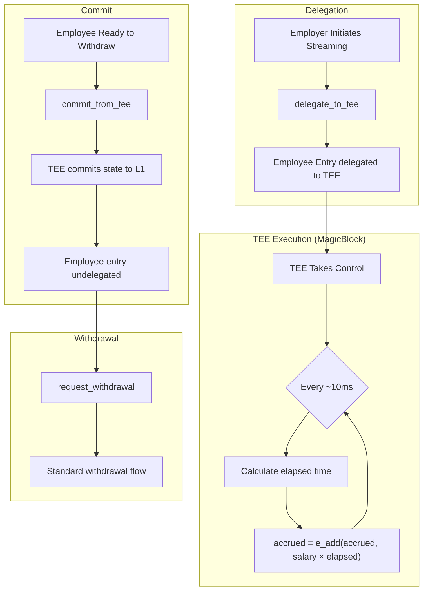
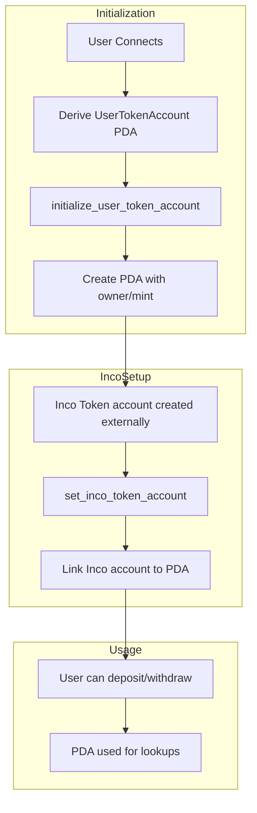
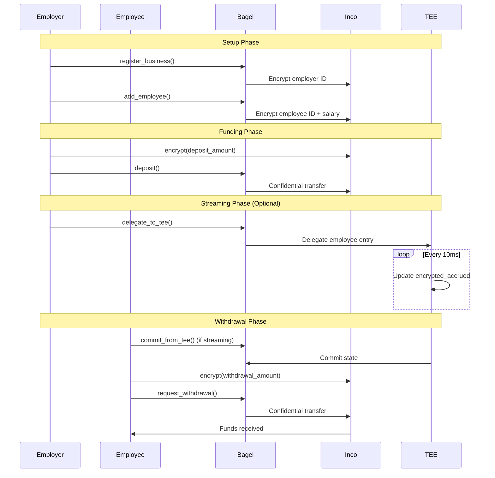

# Data Flow

Complete data flow diagrams for all operations.

## Business Onboarding

```mermaid
flowchart TD
    subgraph Client
        A[Connect Wallet] --> B[Enter Business Info]
        B --> C[Sign Transaction]
    end

    subgraph Encryption
        C --> D[Hash Employer Pubkey]
        D --> E[Encrypt Hash via Inco SDK]
        E --> F[Generate Ciphertext]
    end

    subgraph OnChain
        F --> G[register_business]
        G --> H[Get next_business_index]
        H --> I[Create BusinessEntry PDA]
        I --> J[Store encrypted_employer_id]
        J --> K[Initialize encrypted_balance = E(0)]
        K --> L[Increment vault.encrypted_business_count]
    end

    subgraph Result
        L --> M[BusinessRegistered Event]
        M --> N[Update UI]
    end
```

## Deposit Flow

```mermaid
flowchart TD
    subgraph Client
        A[Enter Amount] --> B[Encrypt via Inco SDK]
        B --> C[Submit Transaction]
    end

    subgraph Validation
        C --> D{Confidential tokens enabled?}
        D -->|No| E[Reject: InvalidState]
        D -->|Yes| F[Continue]
    end

    subgraph Transfer
        F --> G[CPI to Inco Tokens]
        G --> H[Transfer encrypted amount]
        H --> I[Update source balance]
        I --> J[Update destination balance]
    end

    subgraph Balance Update
        J --> K[new_euint128(encrypted_amount)]
        K --> L[e_add(business.balance, amount)]
        L --> M[Store new encrypted balance]
    end

    subgraph Result
        M --> N[FundsDeposited Event]
        N --> O[Transaction Confirmed]
    end
```

## Employee Addition

```mermaid
flowchart TD
    subgraph Client
        A[Enter Employee Details] --> B[Hash Employee Pubkey]
        B --> C[Encrypt ID via Inco]
        C --> D[Encrypt Salary via Inco]
        D --> E[Submit Transaction]
    end

    subgraph OnChain
        E --> F[add_employee]
        F --> G[Get next_employee_index]
        G --> H[Create EmployeeEntry PDA]
    end

    subgraph Storage
        H --> I[new_euint128(encrypted_employee_id)]
        I --> J[new_euint128(encrypted_salary)]
        J --> K[encrypted_accrued = E(0)]
    end

    subgraph Counts
        K --> L[business.encrypted_employee_count += E(1)]
        L --> M[vault.encrypted_employee_count += E(1)]
    end

    subgraph Result
        M --> N[EmployeeAdded Event]
    end
```

## Withdrawal Flow

```mermaid
flowchart TD
    subgraph PreCheck
        A[Employee Requests Withdrawal] --> B{Is Active?}
        B -->|No| C[Reject: PayrollInactive]
        B -->|Yes| D{Elapsed >= 60s?}
        D -->|No| E[Reject: WithdrawTooSoon]
        D -->|Yes| F[Continue]
    end

    subgraph Client
        F --> G[Encrypt Amount via Inco]
        G --> H[Submit Transaction]
    end

    subgraph Transfer
        H --> I[CPI to Inco Tokens]
        I --> J[transfer(vault → employee, encrypted)]
        J --> K[Encrypted transfer complete]
    end

    subgraph BalanceUpdate
        K --> L[new_euint128(encrypted_amount)]
        L --> M[e_sub(accrued, amount)]
        M --> N[Update last_action timestamp]
    end

    subgraph Result
        N --> O[WithdrawalProcessed Event]
        O --> P[Funds in Employee Wallet]
    end
```

## TEE Streaming Flow



## Token Account Setup



## Complete Payroll Cycle



## Data Visibility Matrix

| Data Point | Employer | Employee | Observer |
|------------|----------|----------|----------|
| Business exists | Yes | No | Yes (opaque) |
| Employee exists | Yes | Yes | Yes (opaque) |
| Salary amount | Yes (encrypted) | Yes (decrypt) | No |
| Accrued balance | No | Yes (decrypt) | No |
| Transfer amount | Yes (owns) | Yes (decrypt) | No |
| Transaction timing | Yes | Yes | Yes |
| Employer identity | Yes | No | No |
| Employee identity | Yes | Yes | No |
