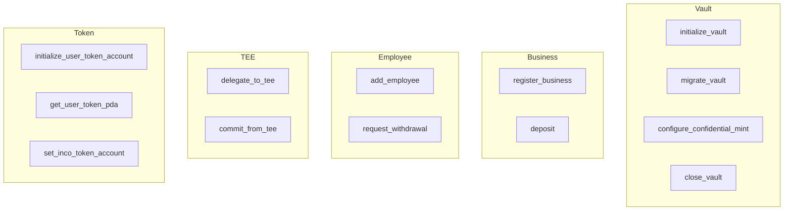

# Program Instructions

Complete documentation of all Bagel program instructions.

## Overview



---

## initialize_vault

Creates the global master vault. One-time setup.

### Signature

```rust
pub fn initialize_vault(ctx: Context<InitializeVault>) -> Result<()>
```

### Accounts

| Account | Type | Description |
|---------|------|-------------|
| `authority` | `Signer` | Vault authority |
| `master_vault` | `Account<MasterVault>` | PDA to create |
| `inco_lightning_program` | `AccountInfo` | Inco Lightning program |
| `system_program` | `Program<System>` | System program |

### Example

```typescript
await program.methods
  .initializeVault()
  .accounts({
    authority: wallet.publicKey,
    masterVault: masterVaultPda,
    incoLightningProgram: INCO_LIGHTNING_ID,
    systemProgram: SystemProgram.programId,
  })
  .rpc();
```

### Events

```rust
#[event]
pub struct VaultInitialized {
    pub authority: Pubkey,
    pub timestamp: i64,
}
```

---

## register_business

Registers a new business with encrypted employer identity.

### Signature

```rust
pub fn register_business(
    ctx: Context<RegisterBusiness>,
    encrypted_employer_id: Vec<u8>,
) -> Result<()>
```

### Arguments

| Arg | Type | Description |
|-----|------|-------------|
| `encrypted_employer_id` | `Vec<u8>` | E(hash(employer_pubkey)) |

### Accounts

| Account | Type | Description |
|---------|------|-------------|
| `employer` | `Signer` | Employer wallet |
| `master_vault` | `Account<MasterVault>` | Master vault |
| `business_entry` | `Account<BusinessEntry>` | PDA to create |
| `inco_lightning_program` | `AccountInfo` | Inco Lightning |
| `system_program` | `Program<System>` | System program |

### Example

```typescript
const encryptedEmployerId = await incoClient.encrypt(
  await incoClient.hashPubkey(wallet.publicKey)
);

await program.methods
  .registerBusiness(Buffer.from(encryptedEmployerId))
  .accounts({
    employer: wallet.publicKey,
    masterVault: masterVaultPda,
    businessEntry: businessEntryPda,
    incoLightningProgram: INCO_LIGHTNING_ID,
    systemProgram: SystemProgram.programId,
  })
  .rpc();
```

### Events

```rust
#[event]
pub struct BusinessRegistered {
    pub entry_index: u64,
    pub timestamp: i64,
    // NOTE: No employer pubkey for privacy
}
```

---

## deposit

Deposits funds using confidential token transfer.

### Signature

```rust
pub fn deposit(
    ctx: Context<Deposit>,
    encrypted_amount: Vec<u8>,
) -> Result<()>
```

### Arguments

| Arg | Type | Description |
|-----|------|-------------|
| `encrypted_amount` | `Vec<u8>` | Encrypted deposit amount |

### Accounts

| Account | Type | Description |
|---------|------|-------------|
| `depositor` | `Signer` | Depositor wallet |
| `master_vault` | `Account<MasterVault>` | Master vault |
| `business_entry` | `Account<BusinessEntry>` | Business entry |
| `inco_lightning_program` | `AccountInfo` | Inco Lightning |
| `inco_token_program` | `Option<AccountInfo>` | Inco Token program |
| `depositor_token_account` | `Option<AccountInfo>` | Source token account |
| `master_vault_token_account` | `Option<AccountInfo>` | Vault token account |
| `system_program` | `Program<System>` | System program |

### Example

```typescript
const encryptedAmount = await incoClient.encrypt(1_000_000_000n);

await program.methods
  .deposit(Buffer.from(encryptedAmount))
  .accounts({
    depositor: wallet.publicKey,
    masterVault: masterVaultPda,
    businessEntry: businessEntryPda,
    incoLightningProgram: INCO_LIGHTNING_ID,
    incoTokenProgram: INCO_TOKEN_ID,
    depositorTokenAccount: depositorTokenPda,
    masterVaultTokenAccount: vaultTokenPda,
    systemProgram: SystemProgram.programId,
  })
  .rpc();
```

### Events

```rust
#[event]
pub struct FundsDeposited {
    pub entry_index: u64,
    pub timestamp: i64,
    // NOTE: No amount for privacy
}
```

---

## add_employee

Adds an employee with encrypted identity and salary.

### Signature

```rust
pub fn add_employee(
    ctx: Context<AddEmployee>,
    encrypted_employee_id: Vec<u8>,
    encrypted_salary: Vec<u8>,
) -> Result<()>
```

### Arguments

| Arg | Type | Description |
|-----|------|-------------|
| `encrypted_employee_id` | `Vec<u8>` | E(hash(employee_pubkey)) |
| `encrypted_salary` | `Vec<u8>` | E(salary_per_period) |

### Accounts

| Account | Type | Description |
|---------|------|-------------|
| `employer` | `Signer` | Employer wallet |
| `master_vault` | `Account<MasterVault>` | Master vault |
| `business_entry` | `Account<BusinessEntry>` | Business entry |
| `employee_entry` | `Account<EmployeeEntry>` | PDA to create |
| `inco_lightning_program` | `AccountInfo` | Inco Lightning |
| `system_program` | `Program<System>` | System program |

### Example

```typescript
const encryptedEmployeeId = await incoClient.encrypt(
  await incoClient.hashPubkey(employeePubkey)
);
const encryptedSalary = await incoClient.encrypt(100_000_000n);

await program.methods
  .addEmployee(
    Buffer.from(encryptedEmployeeId),
    Buffer.from(encryptedSalary)
  )
  .accounts({
    employer: wallet.publicKey,
    masterVault: masterVaultPda,
    businessEntry: businessEntryPda,
    employeeEntry: employeeEntryPda,
    incoLightningProgram: INCO_LIGHTNING_ID,
    systemProgram: SystemProgram.programId,
  })
  .rpc();
```

### Events

```rust
#[event]
pub struct EmployeeAdded {
    pub business_index: u64,
    pub employee_index: u64,
    pub timestamp: i64,
    // NOTE: No pubkeys for privacy
}
```

---

## request_withdrawal

Processes employee withdrawal with confidential transfer.

### Signature

```rust
pub fn request_withdrawal(
    ctx: Context<RequestWithdrawal>,
    encrypted_amount: Vec<u8>,
    use_shadowwire: bool,
) -> Result<()>
```

### Arguments

| Arg | Type | Description |
|-----|------|-------------|
| `encrypted_amount` | `Vec<u8>` | Encrypted withdrawal amount |
| `use_shadowwire` | `bool` | Enable additional ZK privacy |

### Accounts

| Account | Type | Description |
|---------|------|-------------|
| `withdrawer` | `Signer` | Employee wallet |
| `master_vault` | `Account<MasterVault>` | Master vault |
| `business_entry` | `Account<BusinessEntry>` | Business entry |
| `employee_entry` | `Account<EmployeeEntry>` | Employee entry |
| `inco_lightning_program` | `AccountInfo` | Inco Lightning |
| `inco_token_program` | `Option<AccountInfo>` | Inco Token program |
| `master_vault_token_account` | `Option<AccountInfo>` | Vault token account |
| `employee_token_account` | `Option<AccountInfo>` | Employee token account |
| `system_program` | `Program<System>` | System program |

### Rate Limiting

```rust
// Must wait 60 seconds between withdrawals
require!(
    time_elapsed >= MIN_WITHDRAW_INTERVAL,
    BagelError::WithdrawTooSoon
);
```

### Example

```typescript
const encryptedAmount = await incoClient.encrypt(50_000_000n);

await program.methods
  .requestWithdrawal(Buffer.from(encryptedAmount), false)
  .accounts({
    withdrawer: employeeWallet.publicKey,
    masterVault: masterVaultPda,
    businessEntry: businessEntryPda,
    employeeEntry: employeeEntryPda,
    incoLightningProgram: INCO_LIGHTNING_ID,
    incoTokenProgram: INCO_TOKEN_ID,
    masterVaultTokenAccount: vaultTokenPda,
    employeeTokenAccount: employeeTokenPda,
    systemProgram: SystemProgram.programId,
  })
  .rpc();
```

### Events

```rust
#[event]
pub struct WithdrawalProcessed {
    pub business_index: u64,
    pub employee_index: u64,
    pub timestamp: i64,
    pub shadowwire_enabled: bool,
    // NOTE: No amount for privacy
}
```

---

## delegate_to_tee

Delegates employee entry to MagicBlock TEE for streaming.

### Signature

```rust
pub fn delegate_to_tee(ctx: Context<DelegateToTee>) -> Result<()>
```

### Accounts

| Account | Type | Description |
|---------|------|-------------|
| `payer` | `Signer` | Transaction payer |
| `master_vault` | `Account<MasterVault>` | Master vault |
| `business_entry` | `Account<BusinessEntry>` | Business entry |
| `employee_entry` | `Account<EmployeeEntry>` | Employee entry (delegated) |
| `validator` | `Option<AccountInfo>` | TEE validator |
| `system_program` | `Program<System>` | System program |

### Example

```typescript
await program.methods
  .delegateToTee()
  .accounts({
    payer: wallet.publicKey,
    masterVault: masterVaultPda,
    businessEntry: businessEntryPda,
    employeeEntry: employeeEntryPda,
    validator: TEE_VALIDATOR,
    systemProgram: SystemProgram.programId,
  })
  .rpc();
```

---

## commit_from_tee

Commits TEE state back to L1.

### Signature

```rust
pub fn commit_from_tee(ctx: Context<CommitFromTee>) -> Result<()>
```

### Accounts

| Account | Type | Description |
|---------|------|-------------|
| `payer` | `Signer` | Transaction payer |
| `master_vault` | `Account<MasterVault>` | Master vault |
| `business_entry` | `Account<BusinessEntry>` | Business entry |
| `employee_entry` | `Account<EmployeeEntry>` | Employee entry |
| `magic_context` | `AccountInfo` | MagicBlock context |
| `magic_program` | `AccountInfo` | MagicBlock program |
| `system_program` | `Program<System>` | System program |

---

## configure_confidential_mint

Configures confidential token mint for the vault.

### Signature

```rust
pub fn configure_confidential_mint(
    ctx: Context<ConfigureConfidentialMint>,
    mint: Pubkey,
    enable: bool,
) -> Result<()>
```

### Arguments

| Arg | Type | Description |
|-----|------|-------------|
| `mint` | `Pubkey` | Confidential token mint |
| `enable` | `bool` | Enable/disable feature |

### Example

```typescript
await program.methods
  .configureConfidentialMint(USDBAGEL_MINT, true)
  .accounts({
    authority: wallet.publicKey,
    masterVault: masterVaultPda,
  })
  .rpc();
```

---

## Error Codes

| Code | Name | Description |
|------|------|-------------|
| 6000 | InvalidCiphertext | Empty or malformed ciphertext |
| 6001 | InvalidAmount | Amount must be > 0 |
| 6002 | Overflow | Arithmetic overflow |
| 6003 | Underflow | Arithmetic underflow |
| 6004 | InvalidTimestamp | Clock error |
| 6005 | WithdrawTooSoon | Must wait 60s between actions |
| 6006 | NoAccruedDough | No balance to withdraw |
| 6007 | InsufficientFunds | Vault balance too low |
| 6008 | Unauthorized | Signer not authorized |
| 6009 | PayrollInactive | Entry is not active |
| 6010 | InvalidState | Invalid program state |
| 6011 | IdentityVerificationFailed | ID verification failed |
