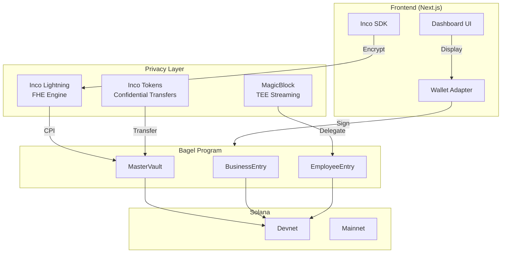
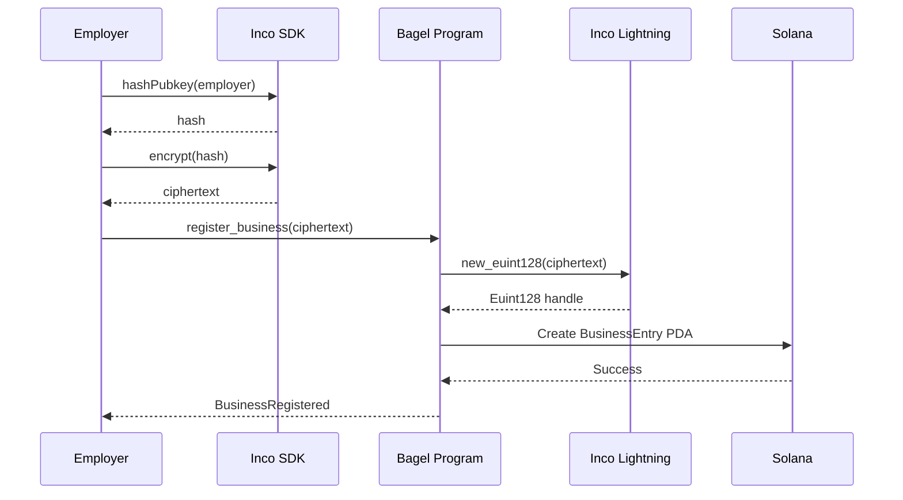
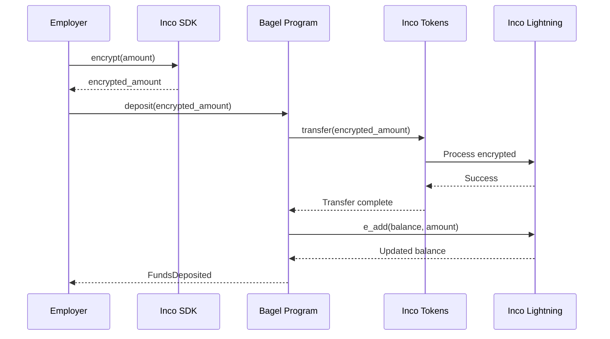
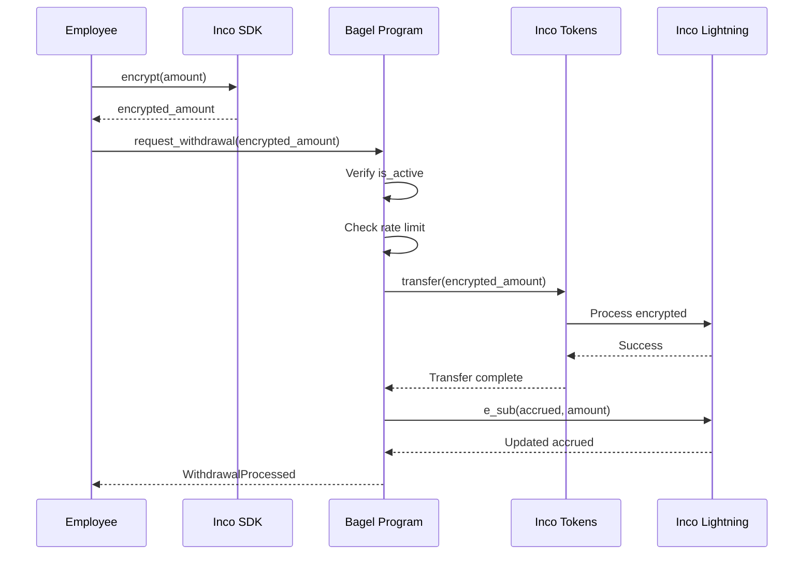
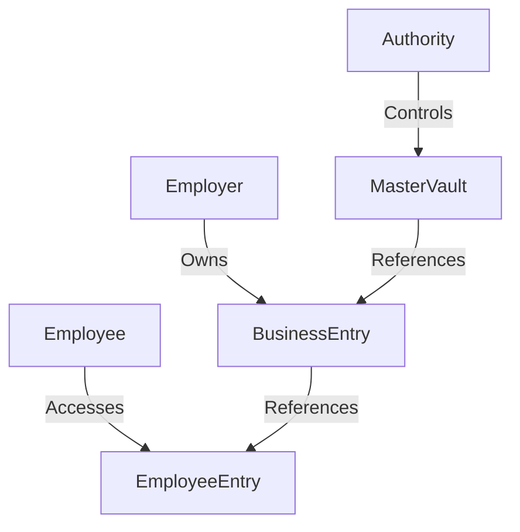

# Architecture Overview

Complete technical architecture of the Bagel Protocol.

## System Diagram



## Component Architecture

### 1. Frontend Layer

| Component | Technology | Purpose |
|-----------|------------|---------|
| Framework | Next.js 15 | SSR + React |
| Styling | Tailwind CSS v4 | Design system |
| Wallet | Solana Wallet Adapter | Multi-wallet support |
| State | React Query | Server state |
| Encryption | Inco SDK | Client-side FHE |

### 2. Privacy Layer

| Component | Program ID | Purpose |
|-----------|------------|---------|
| Inco Lightning | `5sjEbPiqgZrYwR31ahR6Uk9wf5awoX61YGg7jExQSwaj` | FHE operations |
| Inco Token Program | `4cyJHzecVWuU2xux6bCAPAhALKQT8woBh4Vx3AGEGe5N` | Encrypted transfers |
| MagicBlock | `DELeGGvXpWV2fqJUhqcF5ZSYMS4JTLjteaAMARRSaeSh` | TEE delegation |

### 3. Program Layer

| Account | Purpose | Privacy |
|---------|---------|---------|
| MasterVault | Global fund pool | Encrypted counts |
| BusinessEntry | Employer account | Encrypted balance/ID |
| EmployeeEntry | Employee account | Encrypted salary/accrued |
| UserTokenAccount | Token account registry | PDA-based |

## Data Flow

### Business Registration



### Deposit Flow



### Withdrawal Flow



## Security Architecture

### Access Control



### PDA Derivation

```
MasterVault
├── Seeds: ["master_vault"]
├── Bump: Computed
└── Owner: Bagel Program

BusinessEntry
├── Seeds: ["entry", master_vault, index]
├── Index: Sequential counter
└── Owner: Bagel Program

EmployeeEntry
├── Seeds: ["employee", business_entry, index]
├── Index: Sequential counter
└── Owner: Bagel Program
```

## Network Configuration

### Devnet

```toml
[programs.devnet]
bagel = "AEd52vEEAdXWUjKut1aQyLLJQnwMWqYMb4hSaHpxd8Hj"

[provider]
cluster = "devnet"
```

### Mainnet (Planned)

```toml
[programs.mainnet]
bagel = "TBD"

[provider]
cluster = "mainnet-beta"
```

## Infrastructure

### RPC Provider

- **Provider**: Helius
- **Devnet**: `https://devnet.helius-rpc.com`
- **Features**: DAS API, Websockets, Enhanced transactions

### TEE Infrastructure

- **Provider**: MagicBlock
- **Validator**: `FnE6VJT5QNZdedZPnCoLsARgBwoE6DeJNjBs2H1gySXA`
- **Update frequency**: ~10ms

## Scalability

| Metric | Limit |
|--------|-------|
| Businesses per vault | Unlimited |
| Employees per business | Unlimited |
| Concurrent operations | ~1000 TPS |
| Account size | 10 MB |
| CPI depth | 4 levels |

## Next Steps

- [Account Structures](./accounts) - Detailed account layouts
- [Instructions](./instructions) - All program instructions
- [Data Flow](./data-flow) - Complete data flow diagrams
- [Mathematics](./mathematics) - Cryptographic formulas
