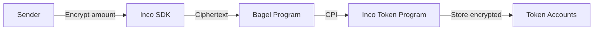
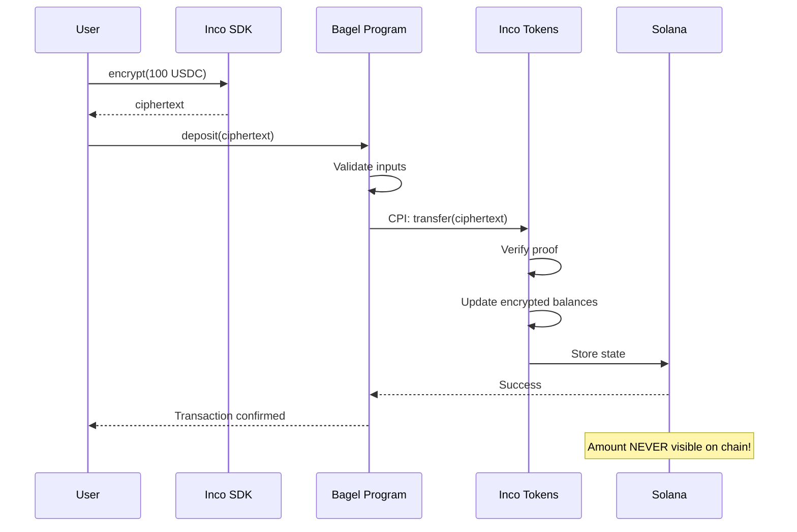

# Confidential Tokens

Encrypted token transfers using Inco Confidential Tokens.

## Overview

Confidential tokens enable transfers where the **amount is encrypted**. Only the sender, receiver, and authorized parties can see the actual value.

## How It Works



### Traditional vs Confidential

| Aspect | Traditional SPL | Confidential Tokens |
|--------|-----------------|---------------------|
| Amount visibility | Public | Encrypted |
| Balance visibility | Public | Encrypted |
| Transfer verification | Amount checked | Proof verified |
| Observer knowledge | Full | Nothing |

## Token Program

- **Program ID**: `HuUn2JwCPCLWwJ3z17m7CER73jseqsxvbcFuZN4JAw22`
- **Token Mint**: `A3G2NBGL7xH9T6BYwVkwRGsSYxtFPdg4HSThfTmV94ht` (USDBagel)

## Transfer Implementation

### Deposit (User → Vault)

```rust
pub fn deposit(
    ctx: Context<Deposit>,
    encrypted_amount: Vec<u8>,
) -> Result<()> {
    // Build CPI context
    let cpi_accounts = IncoTransfer {
        source: depositor_token.to_account_info(),
        destination: vault_token.to_account_info(),
        authority: depositor_info,
        inco_lightning_program: ctx.accounts.inco_lightning_program.to_account_info(),
        system_program: ctx.accounts.system_program.to_account_info(),
    };
    let cpi_ctx = CpiContext::new(
        inco_token_program.to_account_info(),
        cpi_accounts,
    );

    // Transfer with encrypted amount
    transfer(cpi_ctx, encrypted_amount.clone(), 0)?;

    Ok(())
}
```

### Withdrawal (Vault → User)

```rust
pub fn request_withdrawal(
    ctx: Context<RequestWithdrawal>,
    encrypted_amount: Vec<u8>,
    use_shadowwire: bool,
) -> Result<()> {
    // Use vault PDA as signer
    let bump = vault.bump;
    let seeds: &[&[&[u8]]] = &[&[MASTER_VAULT_SEED, &[bump]]];

    let cpi_accounts = IncoTransfer {
        source: vault_token.to_account_info(),
        destination: employee_token.to_account_info(),
        authority: vault.to_account_info(),
        inco_lightning_program: ctx.accounts.inco_lightning_program.to_account_info(),
        system_program: ctx.accounts.system_program.to_account_info(),
    };
    let cpi_ctx = CpiContext::new_with_signer(
        inco_token_program.to_account_info(),
        cpi_accounts,
        seeds,
    );

    // Transfer with encrypted amount
    transfer(cpi_ctx, encrypted_amount.clone(), 0)?;

    Ok(())
}
```

## Client-Side Usage

### Create Encrypted Transfer

```typescript
import { IncoClient } from '@inco/sdk';

const incoClient = new IncoClient({ network: 'devnet' });

// Encrypt amount for transfer
const amount = 100_000_000n; // 100 USDC (6 decimals)
const encryptedAmount = await incoClient.encrypt(amount);

// Submit to Bagel program
await program.methods
  .deposit(Buffer.from(encryptedAmount))
  .accounts({ /* ... */ })
  .rpc();
```

### Check Encrypted Balance

```typescript
// Fetch token account
const tokenAccount = await incoClient.getTokenAccount(userTokenPda);

// Decrypt balance (requires authorization)
const balance = await incoClient.decryptBalance(tokenAccount.encryptedBalance);
console.log(`Balance: ${balance / 1_000_000} USDC`);
```

## Account Structure

### Confidential Token Account

```
┌────────────────────────────────────────────────────────────┐
│                 Inco Token Account                          │
├──────────┬────────┬─────────────────────────────────────────┤
│  Field   │  Size  │  Description                            │
├──────────┼────────┼─────────────────────────────────────────┤
│  owner   │  32    │  Account owner pubkey                   │
│  mint    │  32    │  Token mint pubkey                      │
│  balance │  16    │  Euint128 (ENCRYPTED)                   │
│  state   │  1     │  Account state                          │
└──────────┴────────┴─────────────────────────────────────────┘
```

## Transaction Flow



## Privacy Guarantees

### What Observers Cannot See

1. **Transfer amounts** - Only encrypted ciphertext visible
2. **Account balances** - Stored encrypted
3. **Running totals** - Cannot sum transactions
4. **Payment patterns** - Amounts obscured

### What Observers Can See

1. **Transaction existence** - That a transfer happened
2. **Participants** - Source and destination accounts
3. **Timing** - When transfer occurred
4. **Program ID** - Which program processed it

## Integration with Bagel

### Account Setup

```typescript
// Initialize user token account PDA
const [userTokenPda] = PublicKey.findProgramAddressSync(
  [
    Buffer.from('user_token'),
    userWallet.toBuffer(),
    mintPubkey.toBuffer(),
  ],
  BAGEL_PROGRAM_ID
);

await program.methods
  .initializeUserTokenAccount()
  .accounts({
    owner: userWallet,
    mint: mintPubkey,
    userTokenAccount: userTokenPda,
    incoLightningProgram: INCO_LIGHTNING_ID,
    systemProgram: SystemProgram.programId,
  })
  .rpc();
```

### Link Inco Token Account

```typescript
// After Inco token account is created
await program.methods
  .setIncoTokenAccount(incoTokenAccountPubkey)
  .accounts({
    authority: userWallet,
    owner: userWallet,
    mint: mintPubkey,
    userTokenAccount: userTokenPda,
  })
  .rpc();
```

## Best Practices

1. **Always use encrypted amounts** - Never pass plaintext
2. **Validate ciphertext** - Check format before submission
3. **Handle errors gracefully** - Transfer can fail on invalid proof
4. **Use batch operations** - Reduce transaction costs

```rust
// Good: Validate ciphertext
require!(!encrypted_amount.is_empty(), BagelError::InvalidCiphertext);

// Good: Error handling
transfer(cpi_ctx, encrypted_amount, 0)
    .map_err(|e| {
        msg!("Confidential transfer failed: {:?}", e);
        BagelError::InvalidState
    })?;
```

## Troubleshooting

### Common Issues

**"Invalid ciphertext format"**
- Ensure you're using the Inco SDK to encrypt
- Check the encryption network matches (devnet/mainnet)

**"Insufficient balance"**
- Balance is encrypted but still checked via proof
- Ensure source account has funds

**"Authorization failed"**
- Check the signer has authority over the account
- Verify PDA seeds are correct

## References

- [Inco Token Documentation](https://docs.inco.org/svm/tokens)
- [Confidential Transfer Guide](https://docs.inco.org/svm/confidential-transfers)
