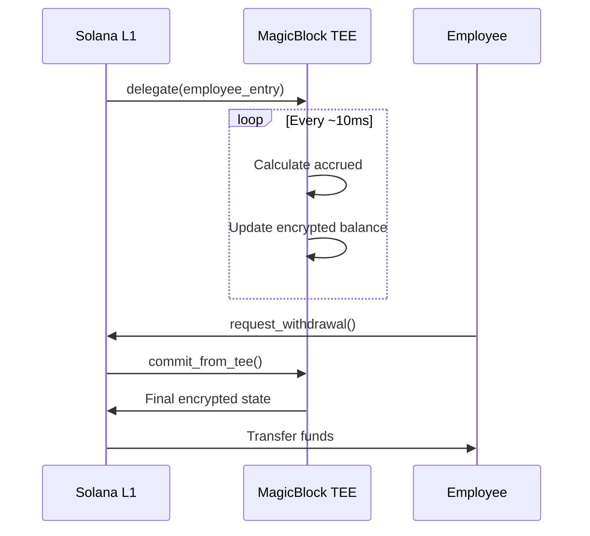
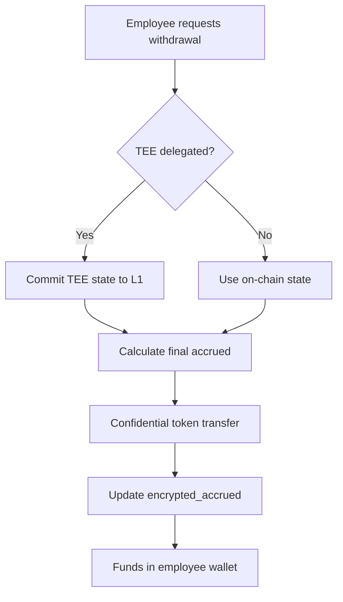

# Payroll Streaming

Real-time salary streaming with encrypted calculations.

## Overview

Bagel supports two modes of payroll:

1. **Batch Payments** - Traditional periodic payments
2. **Real-time Streaming** - Continuous salary accrual via TEE

## Streaming Mathematics

### Basic Formula

The accrued salary at any time t is:

```
A(t) = S × Δt

Where:
  A(t) = Accrued amount at time t
  S = Salary rate (per second)
  Δt = Time elapsed since last action
```

### Encrypted Streaming

With FHE, this becomes:

```
E(A(t)) = E(S) ⊗ Δt

Where:
  E(x) = Encryption of x
  ⊗ = Homomorphic scalar multiplication
```

The calculation happens **without decrypting** the salary!

## Implementation

### On-Chain Calculation

```rust
pub fn calculate_accrued(
    encrypted_salary: &Euint128,
    elapsed_seconds: u64,
) -> Result<Euint128> {
    // Homomorphic multiplication: E(salary) × time = E(salary × time)
    let accrued = e_mul_scalar(
        cpi_ctx,
        encrypted_salary.clone(),
        elapsed_seconds,
        0,
    )?;

    Ok(accrued)
}
```

### Client-Side Verification

```typescript
// Employee can verify their accrued balance
const employee = await program.account.employeeEntry.fetch(employeeEntryPda);
const accrued = await incoClient.decrypt(employee.encryptedAccrued);
console.log(`Accrued: ${accrued / 1e6} USDC`);
```

## Real-Time Streaming with TEE

For sub-second granularity, Bagel uses MagicBlock TEE:



### Delegation

```rust
pub fn delegate_to_tee(ctx: Context<DelegateToTee>) -> Result<()> {
    ctx.accounts.delegate_employee_entry(
        &ctx.accounts.payer,
        seeds,
        DelegateConfig {
            validator: Some(TEE_VALIDATOR),
            ..Default::default()
        },
    )?;
    Ok(())
}
```

### Commit State

```rust
pub fn commit_from_tee(ctx: Context<CommitFromTee>) -> Result<()> {
    commit_and_undelegate_accounts(
        &payer_info,
        vec![&employee_info],
        &magic_context_info,
        &magic_program_info,
    )?;
    Ok(())
}
```

## Streaming Visualization

```
Time →
─────────────────────────────────────────────────────────────────────►

Salary Rate: $100/hour = $0.0278/second (ENCRYPTED)

t=0        t=1s       t=60s      t=3600s    t=86400s
│          │          │          │          │
▼          ▼          ▼          ▼          ▼
E($0)      E($0.03)   E($1.67)   E($100)    E($2,400)
           Δ=1s       Δ=60s      Δ=3600s    Δ=86400s

All calculations happen on ENCRYPTED values!
```

## Withdrawal Flow



## Rate Limiting

To prevent abuse, withdrawals are rate-limited:

```rust
pub const MIN_WITHDRAW_INTERVAL: i64 = 60; // 60 seconds

// In request_withdrawal:
let time_elapsed = clock.unix_timestamp
    .checked_sub(employee.last_action)
    .ok_or(BagelError::InvalidTimestamp)?;

require!(
    time_elapsed >= MIN_WITHDRAW_INTERVAL,
    BagelError::WithdrawTooSoon
);
```

## Example: Full Streaming Workflow

### 1. Setup Employee with Streaming

```typescript
// Employer adds employee with salary
const monthlySalary = 10_000_000_000; // $10,000 USDC
const salaryPerSecond = Math.floor(monthlySalary / (30 * 24 * 3600));

await program.methods
  .addEmployee(
    Buffer.from(encryptedEmployeeId),
    Buffer.from(await incoClient.encrypt(salaryPerSecond))
  )
  .accounts({ /* ... */ })
  .rpc();

// Enable TEE streaming
await program.methods
  .delegateToTee()
  .accounts({
    employeeEntry: employeeEntryPda,
    validator: TEE_VALIDATOR,
    /* ... */
  })
  .rpc();
```

### 2. Employee Monitors Balance

```typescript
// Check accrued balance anytime
const employee = await program.account.employeeEntry.fetch(employeeEntryPda);
const accrued = await incoClient.decrypt(employee.encryptedAccrued);
console.log(`Current accrued: $${(accrued / 1_000_000).toFixed(2)}`);
```

### 3. Employee Withdraws

```typescript
// Commit TEE state first
await program.methods
  .commitFromTee()
  .accounts({ /* ... */ })
  .rpc();

// Request withdrawal
const withdrawAmount = accrued; // Withdraw all
await program.methods
  .requestWithdrawal(
    Buffer.from(await incoClient.encrypt(withdrawAmount)),
    false
  )
  .accounts({ /* ... */ })
  .rpc();
```

## Performance Characteristics

| Metric | L1 Only | With TEE |
|--------|---------|----------|
| Update frequency | Per transaction | ~10ms |
| Granularity | 1 transaction | Sub-second |
| Cost per update | ~0.001 SOL | Batched |
| Privacy | Maximum | Maximum |

## Best Practices

1. **Use TEE for frequent updates** - If employees need real-time visibility
2. **Batch withdrawals** - Minimize transaction costs
3. **Set reasonable intervals** - Balance UX with costs
4. **Monitor TEE state** - Ensure commits happen regularly
