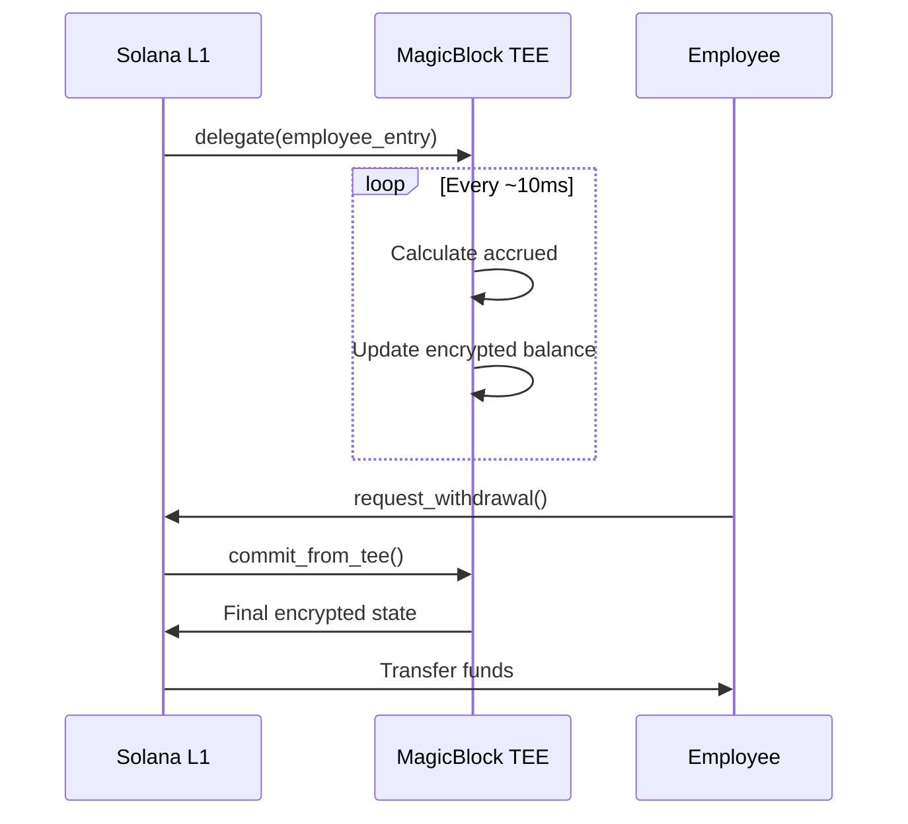

# Payroll Streaming

Understanding real-time salary streaming with encrypted calculations.

## Overview

Bagel supports two modes of payroll:

1. **Batch Payments** - Traditional periodic payments
2. **Real-time Streaming** - Continuous salary accrual via TEE

## Streaming Mathematics

### Basic Formula

The accrued salary at any time t is:

```
A(t) = S × Δt

Where:
  A(t) = Accrued amount at time t
  S = Salary rate (per second)
  Δt = Time elapsed since last action
```

### Encrypted Streaming

With FHE, this becomes:

```
E(A(t)) = E(S) ⊗ Δt

Where:
  E(x) = Encryption of x
  ⊗ = Homomorphic scalar multiplication
```

The calculation happens **without decrypting** the salary. See [Mathematics](../architecture/mathematics) for formal derivations.

## How It Works



## Performance

| Metric | L1 Only | With TEE |
|--------|---------|----------|
| Update frequency | Per transaction | ~10ms |
| Granularity | 1 transaction | Sub-second |
| Cost per update | ~0.001 SOL | Batched |
| Privacy | Maximum | Maximum |

## Implementation

For complete implementation details, see the Payroll Program documentation:

- [Employee Lifecycle](../payroll-program/employee-lifecycle) - Full streaming workflow
- [Payroll Instructions](../payroll-program/instructions) - TEE instruction reference
- [MagicBlock TEE Integration](../integration/magicblock-tee) - TEE setup guide
