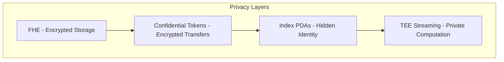
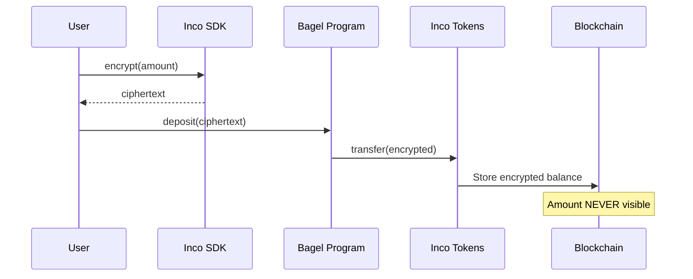
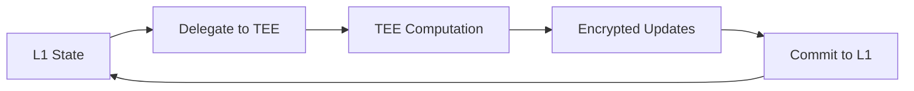

# Privacy Layer

Bagel implements a multi-layered privacy architecture to ensure complete confidentiality of payroll data.

## Overview



## Layer 1: Fully Homomorphic Encryption (FHE)

All sensitive data is stored encrypted using Inco Lightning's FHE implementation:

| Field | Encryption | Visibility |
|-------|------------|------------|
| `encrypted_salary` | Euint128 | Only owner can decrypt |
| `encrypted_balance` | Euint128 | Only owner can decrypt |
| `encrypted_accrued` | Euint128 | Only owner can decrypt |
| `encrypted_employer_id` | Euint128 | Only employer can decrypt |
| `encrypted_employee_id` | Euint128 | Only employee can decrypt |
| `encrypted_business_count` | Euint128 | Only authority can decrypt |
| `encrypted_employee_count` | Euint128 | Only authority can decrypt |

### Homomorphic Operations

Computations happen on encrypted data without decryption:

```rust
// On-chain: All values remain encrypted
let encrypted_deposit = new_euint128(cpi_ctx, encrypted_amount, 0)?;
entry.encrypted_balance = e_add(
    cpi_ctx,
    entry.encrypted_balance.clone(),
    encrypted_deposit,
    0,
)?;
```

## Layer 2: Confidential Token Transfers

All deposits and withdrawals use Inco Confidential Tokens:



### Transfer Privacy

| Data Point | Visibility |
|------------|------------|
| Transaction exists | Public |
| Sender address | Public |
| Receiver address | Public |
| **Transfer amount** | **Encrypted** |
| **Balance after** | **Encrypted** |

## Layer 3: Index-Based PDAs

Traditional Solana programs leak identity through PDA seeds:

```rust
// TRADITIONAL (LEAKS IDENTITY)
seeds = ["employee", employer_pubkey, employee_pubkey]
//                   ^^^^^^^^^^^^^^^^  ^^^^^^^^^^^^^^^^
//                   Identity leaked!  Identity leaked!
```

Bagel uses sequential indices instead:

```rust
// BAGEL (PRIVATE)
seeds = ["employee", business_pda, employee_index]
//                   ^^^^^^^^^^^  ^^^^^^^^^^^^^^
//                   Opaque PDA   Just a number
```

### What This Means

An observer looking at Bagel accounts sees:

```
BusinessEntry #0 → ???
BusinessEntry #1 → ???
BusinessEntry #2 → ???

EmployeeEntry #0 → belongs to some business (unknown which)
EmployeeEntry #1 → belongs to some business (unknown which)
```

The actual employer/employee pubkeys are stored as **encrypted hashes**:

```rust
pub encrypted_employer_id: Euint128,  // E(hash(employer_pubkey))
pub encrypted_employee_id: Euint128,  // E(hash(employee_pubkey))
```

## Layer 4: TEE-Based Streaming

For real-time salary streaming, MagicBlock TEE provides:

- Computations happen in secure enclave
- State updates every ~10ms
- Final state committed to L1 encrypted



## Privacy Guarantees

### What's Protected

| Data | Protection Level | Method |
|------|-----------------|--------|
| Salary rates | Maximum | FHE Euint128 |
| Accrued balances | Maximum | FHE Euint128 |
| Transfer amounts | Maximum | Confidential Tokens |
| Employer identity | Maximum | FHE + Index PDAs |
| Employee identity | Maximum | FHE + Index PDAs |
| Business count | Maximum | FHE Euint128 |
| Employee count | Maximum | FHE Euint128 |

### What's Public (Unavoidable)

| Data | Why Public |
|------|------------|
| Transaction signatures | Solana requirement |
| Account addresses | Solana requirement |
| Program IDs | Solana requirement |
| Master vault aggregate balance | On-chain requirement |
| Transaction timestamps | Block timestamps |

## Threat Model

### Attacker Capabilities

An attacker with full chain access can:
- Read all transaction data
- Read all account data
- Submit their own transactions
- Monitor timing patterns

### Attacker Limitations

An attacker **cannot**:
- Decrypt FHE ciphertexts without Inco decryption keys
- Link accounts to real-world identities
- Determine salary amounts
- Determine transfer amounts
- Count exact employees or businesses

## Best Practices

### For Employers

1. Use unique index allocation per employee
2. Don't reuse business entries
3. Deposit in random amounts/timing
4. Use batch operations to hide patterns

### For Employees

1. Withdraw at varied intervals
2. Use intermediate wallets if needed
3. Don't correlate withdrawal timing with pay periods

### For Developers

1. Never log decrypted values
2. Use client-side encryption only
3. Validate all encrypted inputs
4. Follow least-privilege for decryption access
