# MagicBlock TEE Integration

Guide to integrating MagicBlock TEE for real-time streaming.

## Overview

MagicBlock provides Trusted Execution Environment (TEE) for real-time state updates:

- **Program ID**: `DELeGGvXpWV2fqJUhqcF5ZSYMS4JTLjteaAMARRSaeSh`
- **TEE Validator**: `FnE6VJT5QNZdedZPnCoLsARgBwoE6DeJNjBs2H1gySXA`
- **Update Frequency**: ~10ms

## Dependencies

### Rust (Program)

```toml
[dependencies]
ephemeral-rollups-sdk = { version = "0.1.0" }
```

### Program Attributes

```rust
use ephemeral_rollups_sdk::anchor::{delegate, ephemeral};

#[ephemeral]
#[program]
pub mod bagel {
    // ... program code
}
```

## Account Delegation

### Delegation Context

```rust
use ephemeral_rollups_sdk::anchor::delegate;
use ephemeral_rollups_sdk::cpi::DelegateConfig;

#[delegate]
#[derive(Accounts)]
pub struct DelegateToTee<'info> {
    #[account(mut)]
    pub payer: Signer<'info>,

    #[account(
        mut,
        del,  // Mark for delegation
        seeds = [EMPLOYEE_ENTRY_SEED, business_entry.key().as_ref(), &employee_entry.employee_index.to_le_bytes()],
        bump = employee_entry.bump,
    )]
    pub employee_entry: Account<'info, EmployeeEntry>,

    /// CHECK: Optional validator
    pub validator: Option<AccountInfo<'info>>,

    pub system_program: Program<'info, System>,
}
```

### Delegation Instruction

```rust
pub fn delegate_to_tee(ctx: Context<DelegateToTee>) -> Result<()> {
    let business_entry_key = ctx.accounts.business_entry.key();
    let employee_index_bytes = ctx.accounts.employee_entry.employee_index.to_le_bytes();

    let seeds: &[&[u8]] = &[
        EMPLOYEE_ENTRY_SEED,
        business_entry_key.as_ref(),
        &employee_index_bytes,
    ];

    let validator_key = ctx.accounts.validator
        .as_ref()
        .map(|v| v.key())
        .or_else(|| Pubkey::try_from(TEE_VALIDATOR).ok());

    ctx.accounts.delegate_employee_entry(
        &ctx.accounts.payer,
        seeds,
        DelegateConfig {
            validator: validator_key,
            ..Default::default()
        },
    )?;

    Ok(())
}
```

## State Commit

### Commit Context

```rust
use ephemeral_rollups_sdk::ephem::commit_and_undelegate_accounts;

#[derive(Accounts)]
pub struct CommitFromTee<'info> {
    #[account(mut)]
    pub payer: Signer<'info>,

    #[account(mut)]
    pub employee_entry: Account<'info, EmployeeEntry>,

    /// CHECK: MagicBlock context
    #[account(mut)]
    pub magic_context: AccountInfo<'info>,

    /// CHECK: MagicBlock program
    pub magic_program: AccountInfo<'info>,

    pub system_program: Program<'info, System>,
}
```

### Commit Instruction

```rust
pub fn commit_from_tee(ctx: Context<CommitFromTee>) -> Result<()> {
    let payer_info = ctx.accounts.payer.to_account_info();
    let employee_info = ctx.accounts.employee_entry.to_account_info();
    let magic_context_info = ctx.accounts.magic_context.to_account_info();
    let magic_program_info = ctx.accounts.magic_program.to_account_info();

    commit_and_undelegate_accounts(
        &payer_info,
        vec![&employee_info],
        &magic_context_info,
        &magic_program_info,
    )?;

    Ok(())
}
```

## Client Usage

### Delegate Account

```typescript
const TEE_VALIDATOR = new PublicKey('FnE6VJT5QNZdedZPnCoLsARgBwoE6DeJNjBs2H1gySXA');

await program.methods
  .delegateToTee()
  .accounts({
    payer: wallet.publicKey,
    masterVault: masterVaultPda,
    businessEntry: businessEntryPda,
    employeeEntry: employeeEntryPda,
    validator: TEE_VALIDATOR,
    systemProgram: SystemProgram.programId,
  })
  .rpc();

console.log('Employee entry delegated to TEE');
```

### Commit State

```typescript
await program.methods
  .commitFromTee()
  .accounts({
    payer: wallet.publicKey,
    masterVault: masterVaultPda,
    businessEntry: businessEntryPda,
    employeeEntry: employeeEntryPda,
    magicContext: magicContextPda,
    magicProgram: MAGICBLOCK_PROGRAM_ID,
    systemProgram: SystemProgram.programId,
  })
  .rpc();

console.log('TEE state committed to L1');
```

## Streaming Flow

```mermaid
sequenceDiagram
    participant E as Employer
    participant L1 as Solana L1
    participant TEE as MagicBlock TEE
    participant EE as Employee

    E->>L1: delegate_to_tee()
    L1->>TEE: Delegate employee entry

    loop Every ~10ms
        TEE->>TEE: Calculate elapsed
        TEE->>TEE: accrued = e_add(accrued, salary × elapsed)
    end

    EE->>L1: request_withdrawal()
    L1->>TEE: commit_from_tee()
    TEE->>L1: Final state
    L1->>EE: Process withdrawal
```



## Performance

| Metric | L1 Only | With TEE |
|--------|---------|----------|
| Update frequency | Per tx (~600ms) | ~10ms |
| Cost per update | ~0.001 SOL | Batched |
| Granularity | Transaction | Sub-second |
| Privacy | Maximum | Maximum |

## Use Cases

### Real-Time Dashboard

```typescript
// Employee sees live accrued balance
const { data: employee, refetch } = useQuery({
  queryKey: ['employee', employeeEntryPda],
  queryFn: async () => {
    return program.account.employeeEntry.fetch(employeeEntryPda);
  },
  refetchInterval: 100, // 100ms refresh
});

// Decrypt and display
const accrued = await incoClient.decrypt(employee.encryptedAccrued);
```

### Instant Withdrawals

With TEE streaming, employees can withdraw exactly what they've earned up to the current moment.

## Best Practices

1. **Delegate only when needed** - Delegation has overhead
2. **Commit before withdrawal** - Ensure state is current
3. **Handle delegation failures** - Network issues can occur
4. **Monitor TEE status** - Check validator availability

## Troubleshooting

### "Delegation failed"

- Verify validator is online
- Check account isn't already delegated
- Ensure proper seeds

### "Commit failed"

- Verify account is delegated
- Check magic_context is valid
- Ensure payer has funds

### "State not updated"

- TEE may be processing
- Wait and retry commit
- Check network connectivity

## Related Documentation

- [Employee Lifecycle](../payroll-program/employee-lifecycle) - Complete employee streaming workflow
- [Payroll Streaming Concepts](../core-concepts/payroll-streaming) - Streaming mathematics

## References

- [MagicBlock Documentation](https://docs.magicblock.gg)
- [Ephemeral Rollups SDK](https://github.com/magicblock-labs)
