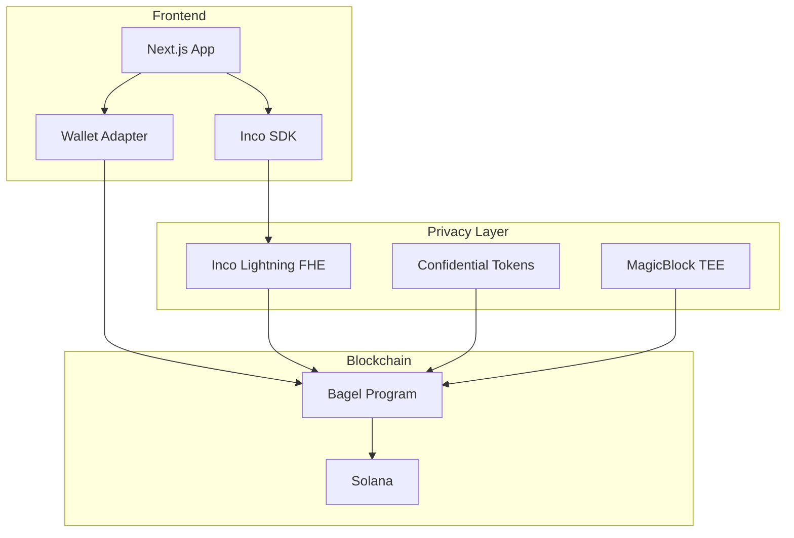

# Welcome to Bagel Protocol

**Privacy-First Payroll Infrastructure on Solana with Fully Homomorphic Encryption (FHE)**

Bagel is a revolutionary payroll protocol that brings complete privacy to employee compensation on the Solana blockchain. Using cutting-edge cryptographic techniques including Fully Homomorphic Encryption (FHE), confidential token transfers, and TEE-based streaming, Bagel ensures that salary data remains encrypted and private at all times.

## Why Bagel?

Traditional payroll systems expose sensitive financial information:
- Salary amounts visible on-chain
- Employer-employee relationships public
- Transaction amounts traceable

**Bagel solves this with maximum privacy:**

| Data | Traditional | Bagel |
|------|-------------|-------|
| Salary amounts | Public | Encrypted (FHE) |
| Account balances | Public | Encrypted (FHE) |
| Transfer amounts | Public | Encrypted (Confidential Tokens) |
| Employer identity | Public | Encrypted + Index PDAs |
| Employee identity | Public | Encrypted + Index PDAs |

## Key Features

### Fully Homomorphic Encryption (FHE)

Powered by **Inco Lightning**, Bagel performs computations on encrypted data without ever decrypting it:

```
E(salary) × E(time) = E(accrued)
```

Salary calculations happen on-chain while the actual values remain completely hidden.

### Confidential Token Transfers

Using **Inco Confidential Tokens**, all deposits and withdrawals use encrypted amounts. Even blockchain observers cannot see how much money moves.

### Index-Based Privacy

Unlike traditional systems that use public keys in account addresses, Bagel uses sequential indices:

```rust
// Traditional (leaks identity)
seeds = ["employee", employer_pubkey, employee_pubkey]

// Bagel (private)
seeds = ["employee", business_pda, employee_index]
```

### Real-Time Streaming

With **MagicBlock TEE integration**, salaries can stream in real-time with sub-second granularity while maintaining privacy.

## Quick Example

```typescript
import { IncoClient } from '@inco/sdk';
import { BagelProgram } from '@bagel/sdk';

// Encrypt salary (client-side)
const encryptedSalary = await incoClient.encryptSalary(100_000_000);

// Add employee with encrypted data
await bagelProgram.addEmployee({
  encryptedEmployeeId: await incoClient.encryptId(employeeWallet),
  encryptedSalary,
});

// Employee withdraws (amount hidden)
await bagelProgram.requestWithdrawal({
  encryptedAmount: await incoClient.encrypt(50_000_000),
});

// Decrypt balance (authorized only)
const balance = await incoClient.decryptSalary(employeeEntry.encryptedAccrued);
```

## Technology Stack



## Get Started

Ready to build with Bagel? Start with our guides:

- [Getting Started](./getting-started) - Quick setup and first steps
- [Installation](./installation) - Detailed installation instructions
- [Core Concepts](./core-concepts/privacy-layer) - Understand the privacy architecture

## Program IDs

| Program | Address | Network |
|---------|---------|---------|
| Bagel | `AEd52vEEAdXWUjKut1aQyLLJQnwMWqYMb4hSaHpxd8Hj` | Devnet |
| Inco Lightning | `5sjEbPiqgZrYwR31ahR6Uk9wf5awoX61YGg7jExQSwaj` | Devnet |
| Inco Tokens | `HuUn2JwCPCLWwJ3z17m7CER73jseqsxvbcFuZN4JAw22` | Devnet |
| MagicBlock | `DELeGGvXpWV2fqJUhqcF5ZSYMS4JTLjteaAMARRSaeSh` | Devnet |

## Resources

- [GitHub Repository](https://github.com/bagel-protocol/bagel)
- [API Reference](./reference/program-api)
- [TypeScript SDK](./reference/typescript-sdk)
