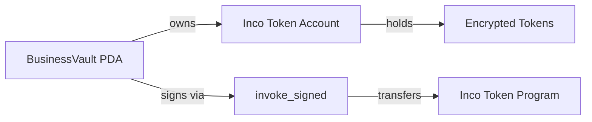

# Payroll Account Structures

Detailed documentation of all Payroll Program account structures.

## Business

Represents a registered business entity with encrypted employee tracking.

### Layout

```
┌──────────────────────────────────────────────────────────────────────────────┐
│                                 Business                                      │
│                            Total Size: 194 bytes                              │
├──────────┬──────────┬───────────────────────────────┬────────────────────────┤
│  Offset  │  Size    │  Field                        │  Type                  │
├──────────┼──────────┼───────────────────────────────┼────────────────────────┤
│  0       │  8       │  discriminator                │  [u8; 8]               │
│  8       │  32      │  owner                        │  Pubkey                │
│  40      │  32      │  vault                        │  Pubkey                │
│  72      │  8       │  next_employee_index          │  u64                   │
│  80      │  32      │  encrypted_employee_count     │  EncryptedHandle       │
│  112     │  1       │  is_active                    │  bool                  │
│  113     │  8       │  created_at                   │  i64                   │
│  121     │  1       │  bump                         │  u8                    │
│  122     │  32      │  padding                      │  [u8; 32]              │
└──────────┴──────────┴───────────────────────────────┴────────────────────────┘
```

### Rust Definition

```rust
#[account]
pub struct Business {
    /// Business owner wallet
    pub owner: Pubkey,

    /// Reference to BusinessVault
    pub vault: Pubkey,

    /// Next employee index for PDA derivation
    pub next_employee_index: u64,

    /// ENCRYPTED employee count (Inco handle)
    pub encrypted_employee_count: EncryptedHandle,

    /// Is business active
    pub is_active: bool,

    /// Creation timestamp
    pub created_at: i64,

    /// Bump seed
    pub bump: u8,
}
```

### PDA Derivation

```rust
seeds = [b"business", owner.key().as_ref()]
```

```typescript
const [businessPda, bump] = PublicKey.findProgramAddressSync(
  [Buffer.from('business'), ownerPubkey.toBuffer()],
  PAYROLL_PROGRAM_ID
);
```

---

## BusinessVault

Token custody account linking business to Inco Confidential Token storage.

### Layout

```
┌──────────────────────────────────────────────────────────────────────────────┐
│                              BusinessVault                                    │
│                            Total Size: 161 bytes                              │
├──────────┬──────────┬───────────────────────────────┬────────────────────────┤
│  Offset  │  Size    │  Field                        │  Type                  │
├──────────┼──────────┼───────────────────────────────┼────────────────────────┤
│  0       │  8       │  discriminator                │  [u8; 8]               │
│  8       │  32      │  business                     │  Pubkey                │
│  40      │  32      │  mint                         │  Pubkey                │
│  72      │  32      │  token_account                │  Pubkey                │
│  104     │  32      │  encrypted_balance            │  EncryptedHandle       │
│  136     │  1       │  bump                         │  u8                    │
│  137     │  32      │  padding                      │  [u8; 32]              │
└──────────┴──────────┴───────────────────────────────┴────────────────────────┘
```

### Rust Definition

```rust
#[account]
pub struct BusinessVault {
    /// Reference to Business
    pub business: Pubkey,

    /// Token mint (USDBagel)
    pub mint: Pubkey,

    /// Inco Token Account address (vault PDA owns this)
    pub token_account: Pubkey,

    /// ENCRYPTED vault balance (Inco handle)
    pub encrypted_balance: EncryptedHandle,

    /// Bump seed
    pub bump: u8,
}
```

### PDA Derivation

```rust
seeds = [b"vault", business.key().as_ref()]
```

```typescript
const [vaultPda, bump] = PublicKey.findProgramAddressSync(
  [Buffer.from('vault'), businessPda.toBuffer()],
  PAYROLL_PROGRAM_ID
);
```

### Token Custody Model



The BusinessVault PDA is set as the owner of the Inco Token Account, enabling programmatic transfers via `invoke_signed`.

---

## Employee

Represents an employee with encrypted identity, salary, and accrued balance.

### Layout

```
┌──────────────────────────────────────────────────────────────────────────────┐
│                                 Employee                                      │
│                            Total Size: 179 bytes                              │
├──────────┬──────────┬───────────────────────────────┬────────────────────────┤
│  Offset  │  Size    │  Field                        │  Type                  │
├──────────┼──────────┼───────────────────────────────┼────────────────────────┤
│  0       │  8       │  discriminator                │  [u8; 8]               │
│  8       │  32      │  business                     │  Pubkey                │
│  40      │  8       │  employee_index               │  u64                   │
│  48      │  32      │  encrypted_employee_id        │  EncryptedHandle       │
│  80      │  32      │  encrypted_salary_rate        │  EncryptedHandle       │
│  112     │  32      │  encrypted_accrued            │  EncryptedHandle       │
│  144     │  8       │  last_accrual_time            │  i64                   │
│  152     │  1       │  is_active                    │  bool                  │
│  153     │  1       │  is_delegated                 │  bool                  │
│  154     │  1       │  bump                         │  u8                    │
│  155     │  32      │  padding                      │  [u8; 32]              │
└──────────┴──────────┴───────────────────────────────┴────────────────────────┘
```

### Rust Definition

```rust
#[account]
pub struct Employee {
    /// Reference to Business
    pub business: Pubkey,

    /// Employee index (NOT wallet pubkey - for privacy)
    pub employee_index: u64,

    /// ENCRYPTED employee ID: E(hash(employee_wallet))
    pub encrypted_employee_id: EncryptedHandle,

    /// ENCRYPTED salary rate (per second)
    pub encrypted_salary_rate: EncryptedHandle,

    /// ENCRYPTED accrued balance
    pub encrypted_accrued: EncryptedHandle,

    /// Last accrual timestamp
    pub last_accrual_time: i64,

    /// Is employee active
    pub is_active: bool,

    /// Is delegated to TEE
    pub is_delegated: bool,

    /// Bump seed
    pub bump: u8,
}
```

### PDA Derivation

```rust
seeds = [b"employee", business.key().as_ref(), &employee_index.to_le_bytes()]
```

```typescript
const [employeePda, bump] = PublicKey.findProgramAddressSync(
  [
    Buffer.from('employee'),
    businessPda.toBuffer(),
    new BN(employeeIndex).toArrayLike(Buffer, 'le', 8),
  ],
  PAYROLL_PROGRAM_ID
);
```

### Privacy Design

The Employee account achieves identity privacy through:

1. **Index-based seeds**: No employee wallet in PDA derivation
2. **Encrypted identity**: `encrypted_employee_id` = E(hash(wallet))
3. **Encrypted salary**: Rate never visible on-chain
4. **Encrypted accrued**: Balance never visible on-chain

```
On-chain visible:        │  Encrypted (Inco):
─────────────────────────┼──────────────────────
employee_index: 0        │  encrypted_employee_id: E(hash(0x...))
business: 0x...          │  encrypted_salary_rate: E(100000)
last_accrual_time: 12345 │  encrypted_accrued: E(50000)
is_active: true          │
is_delegated: false      │
```

---

## EncryptedHandle

32-byte reference to Inco Lightning ciphertexts.

### Definition

```rust
#[derive(AnchorSerialize, AnchorDeserialize, Clone, Copy, Default)]
pub struct EncryptedHandle {
    pub handle: [u8; 32],
}
```

### Purpose

The handle is a pointer to encrypted data stored in the Inco Lightning system:

```
┌─────────────────────────────────────────────────────────────────┐
│                        On-Chain                                  │
│  EncryptedHandle { handle: [32 bytes] }                         │
└─────────────────────────────────────────────────────────────────┘
                              │
                              ▼
┌─────────────────────────────────────────────────────────────────┐
│                    Inco Lightning                                │
│  Ciphertext storage + Homomorphic computation                   │
│  E(value) → actual encrypted data                               │
└─────────────────────────────────────────────────────────────────┘
```

This design:
- Minimizes on-chain storage (32 bytes vs. variable ciphertext size)
- Enables FHE operations via CPI calls
- Maintains full privacy of underlying values

---

## Privacy Analysis

### Public vs Encrypted Fields

| Account | Public Fields | Encrypted Fields |
|---------|---------------|------------------|
| Business | owner, vault, next_employee_index, is_active, created_at | encrypted_employee_count |
| BusinessVault | business, mint, token_account | encrypted_balance |
| Employee | business, employee_index, last_accrual_time, is_active, is_delegated | encrypted_employee_id, encrypted_salary_rate, encrypted_accrued |

### What Observers Cannot Determine

- Which wallet belongs to which employee
- How much any employee earns
- How much any employee has accrued
- How much is in any vault
- Total employee count (encrypted)
- Transfer amounts (confidential tokens)

### What Observers Can Determine

- Number of employee PDAs created (from index)
- When accounts were last updated
- Whether employees are active or delegated
- Business-to-owner relationship

---

## Size Constants

```rust
impl Business {
    pub const LEN: usize = 8 + 32 + 32 + 8 + 32 + 1 + 8 + 1 + 32;
    // = 154 bytes (+ padding for alignment)
}

impl BusinessVault {
    pub const LEN: usize = 8 + 32 + 32 + 32 + 32 + 1 + 32;
    // = 169 bytes
}

impl Employee {
    pub const LEN: usize = 8 + 32 + 8 + 32 + 32 + 32 + 8 + 1 + 1 + 1 + 32;
    // = 187 bytes
}
```

## Rent Exemption

Approximate rent-exemption costs (devnet):

| Account | Size | Rent (SOL) |
|---------|------|------------|
| Business | ~154 bytes | ~0.0015 |
| BusinessVault | ~169 bytes | ~0.0016 |
| Employee | ~187 bytes | ~0.0018 |

## Next Steps

- [Instructions Reference](./instructions) - All program instructions
- [Employee Lifecycle](./employee-lifecycle) - Employee management flows
- [Vault Integration](./vault-integration) - Token custody details
