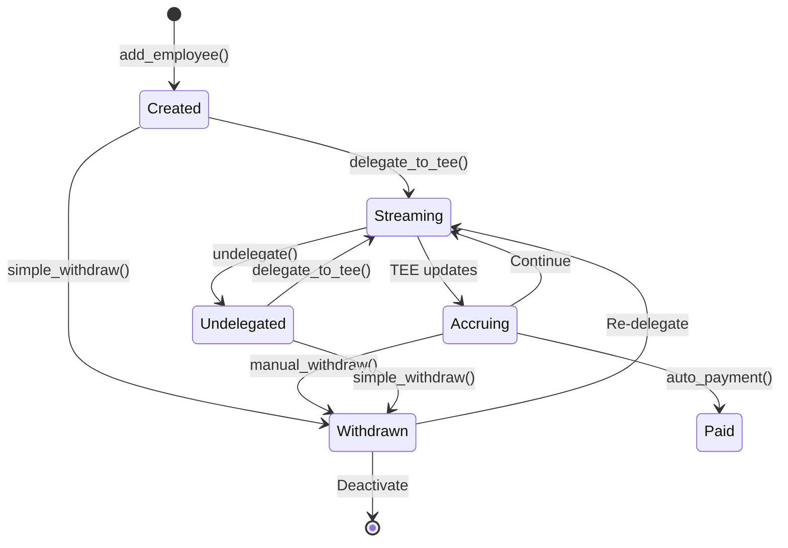
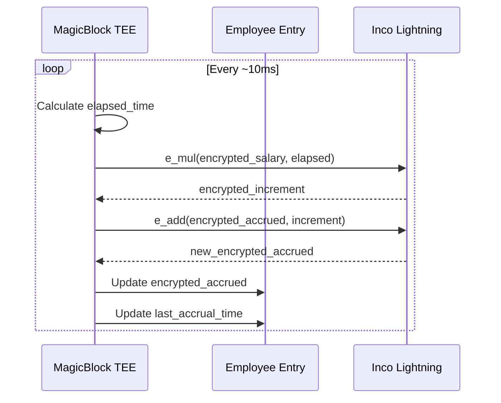
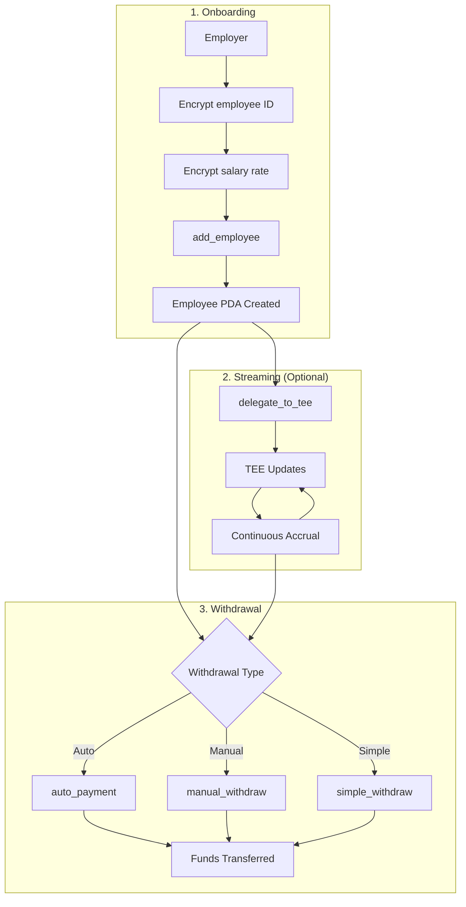

# Employee Lifecycle

Complete documentation of employee management flows in the Payroll Program.

## Lifecycle Overview



## Phase 1: Employee Onboarding

### Step 1: Prepare Encrypted Identity

The employee's identity must be encrypted to protect privacy:

```typescript
// Hash the employee wallet (deterministic)
const employeeHash = await incoClient.hashPubkey(employeeWallet.publicKey);

// Encrypt the hash (only authorized parties can decrypt)
const encryptedEmployeeId = await incoClient.encrypt(employeeHash);
```

### Step 2: Prepare Encrypted Salary

Convert salary to per-second rate and encrypt:

```typescript
// Example: $120,000/year = $10,000/month
const annualSalary = 120_000_000_000n; // $120,000 in base units (9 decimals)
const secondsPerYear = BigInt(365 * 24 * 3600);
const salaryPerSecond = annualSalary / secondsPerYear;

// Encrypt salary rate
const encryptedSalary = await incoClient.encrypt(salaryPerSecond);

// Result: ~3,805 base units per second
```

### Step 3: Create Employee Account

```typescript
// Get next employee index from business account
const business = await program.account.business.fetch(businessPda);
const employeeIndex = business.nextEmployeeIndex;

// Derive employee PDA
const [employeePda] = PublicKey.findProgramAddressSync(
  [
    Buffer.from('employee'),
    businessPda.toBuffer(),
    new BN(employeeIndex).toArrayLike(Buffer, 'le', 8),
  ],
  PAYROLL_PROGRAM_ID
);

// Create employee
await program.methods
  .addEmployee(
    Buffer.from(encryptedEmployeeId),
    Buffer.from(encryptedSalary)
  )
  .accounts({
    owner: wallet.publicKey,
    business: businessPda,
    employee: employeePda,
    incoLightningProgram: INCO_LIGHTNING_ID,
    systemProgram: SystemProgram.programId,
  })
  .rpc();
```

### Initial State

After creation, the employee account contains:

| Field | Value |
|-------|-------|
| `employee_index` | Sequential index (0, 1, 2...) |
| `encrypted_employee_id` | E(hash(wallet)) |
| `encrypted_salary_rate` | E(salary/second) |
| `encrypted_accrued` | E(0) |
| `last_accrual_time` | Creation timestamp |
| `is_active` | true |
| `is_delegated` | false |

---

## Phase 2: Real-Time Streaming (Optional)

For real-time salary accrual, delegate the employee to MagicBlock TEE.

### Enable Streaming

```typescript
const TEE_VALIDATOR = new PublicKey('FnE6VJT5QNZdedZPnCoLsARgBwoE6DeJNjBs2H1gySXA');

await program.methods
  .delegateToTee()
  .accounts({
    payer: wallet.publicKey,
    business: businessPda,
    employee: employeePda,
    validator: TEE_VALIDATOR,
    systemProgram: SystemProgram.programId,
  })
  .rpc();
```

### TEE Accrual Process

Once delegated, the TEE continuously updates the employee's accrued balance:



### Accrual Calculation

```
At time T:
  elapsed = T - last_accrual_time
  increment = E(salary_rate) × elapsed
  new_accrued = E(accrued) + increment

All operations on encrypted values via FHE!
```

### Streaming State

After delegation:

| Field | Value |
|-------|-------|
| `is_delegated` | true |
| `encrypted_accrued` | Continuously updated |
| `last_accrual_time` | Updated every ~10ms |

---

## Phase 3: Salary Withdrawal

Employees can withdraw accrued salary through multiple methods.

### Option A: Auto Payment (TEE-Triggered)

The TEE can automatically process payments on schedule:

```typescript
// Called by TEE or scheduled job
await program.methods
  .autoPayment()
  .accounts({
    payer: payerWallet.publicKey,
    business: businessPda,
    vault: vaultPda,
    employee: employeePda,
    vaultTokenAccount: vaultTokenAccount,
    employeeTokenAccount: employeeTokenAccount,
    incoTokenProgram: INCO_TOKEN_PROGRAM_ID,
    incoLightningProgram: INCO_LIGHTNING_ID,
    magicContext: magicContextPda,
    magicProgram: MAGICBLOCK_PROGRAM_ID,
    systemProgram: SystemProgram.programId,
  })
  .rpc();
```

**Flow:**
1. Commits TEE state to L1
2. Undelegates employee from TEE
3. Transfers full `encrypted_accrued` to employee
4. Resets `encrypted_accrued` to zero

### Option B: Manual Withdrawal (Employee-Initiated)

Employee requests specific amount with TEE commit:

```typescript
// Employee specifies withdrawal amount
const withdrawAmount = await incoClient.encrypt(requestedAmount);

await program.methods
  .manualWithdraw(Buffer.from(withdrawAmount))
  .accounts({
    employeeSigner: employeeWallet.publicKey,
    business: businessPda,
    vault: vaultPda,
    employee: employeePda,
    vaultTokenAccount: vaultTokenAccount,
    employeeTokenAccount: employeeTokenAccount,
    incoTokenProgram: INCO_TOKEN_PROGRAM_ID,
    incoLightningProgram: INCO_LIGHTNING_ID,
    magicContext: magicContextPda,
    magicProgram: MAGICBLOCK_PROGRAM_ID,
    systemProgram: SystemProgram.programId,
  })
  .signers([employeeWallet])
  .rpc();
```

**Requirements:**
- Employee must sign (identity verification)
- If delegated, commits TEE state first
- Amount must not exceed `encrypted_accrued`

### Option C: Simple Withdrawal (No TEE)

For non-streaming mode or testing:

```typescript
const withdrawAmount = await incoClient.encrypt(requestedAmount);

await program.methods
  .simpleWithdraw(Buffer.from(withdrawAmount))
  .accounts({
    employeeSigner: employeeWallet.publicKey,
    business: businessPda,
    vault: vaultPda,
    employee: employeePda,
    vaultTokenAccount: vaultTokenAccount,
    employeeTokenAccount: employeeTokenAccount,
    incoTokenProgram: INCO_TOKEN_PROGRAM_ID,
    incoLightningProgram: INCO_LIGHTNING_ID,
    systemProgram: SystemProgram.programId,
  })
  .signers([employeeWallet])
  .rpc();
```

**Use cases:**
- Devnet testing
- Non-streaming salary models
- Direct pre-funded accruals

---

## Phase 4: Balance Monitoring

### Employee View

Employees can check their accrued balance (authorized decryption):

```typescript
// Fetch employee account
const employee = await program.account.employee.fetch(employeePda);

// Decrypt accrued balance (requires authorization)
const accruedBalance = await incoClient.decrypt(
  employee.encryptedAccrued,
  employeeWallet // Must be authorized
);

console.log(`Accrued: ${accruedBalance / 1_000_000_000} USDBagel`);
```

### Employer View

Employers can view all employee indices (not identities):

```typescript
const business = await program.account.business.fetch(businessPda);
const employeeCount = business.nextEmployeeIndex.toNumber();

console.log(`Total employees: ${employeeCount}`);

// Fetch all employee PDAs
for (let i = 0; i < employeeCount; i++) {
  const [employeePda] = PublicKey.findProgramAddressSync(
    [
      Buffer.from('employee'),
      businessPda.toBuffer(),
      new BN(i).toArrayLike(Buffer, 'le', 8),
    ],
    PAYROLL_PROGRAM_ID
  );

  const employee = await program.account.employee.fetch(employeePda);
  console.log(`Employee ${i}: active=${employee.isActive}, delegated=${employee.isDelegated}`);
}
```

---

## Phase 5: TEE Management

### Undelegate from TEE

Stop streaming without processing payment:

```typescript
await program.methods
  .undelegate()
  .accounts({
    payer: wallet.publicKey,
    business: businessPda,
    employee: employeePda,
    magicContext: magicContextPda,
    magicProgram: MAGICBLOCK_PROGRAM_ID,
    systemProgram: SystemProgram.programId,
  })
  .rpc();
```

**Effect:**
- Commits current TEE state to L1
- Sets `is_delegated = false`
- Employee can still withdraw via `simple_withdraw`

### Re-delegate to TEE

Resume streaming after undelegation:

```typescript
// Simply call delegate_to_tee again
await program.methods
  .delegateToTee()
  .accounts({
    // ... same as initial delegation
  })
  .rpc();
```

---

## Complete Flow Diagram



---

## Token Account Setup

Employees need Inco Token Accounts for receiving payments.

### Create Employee Token Account

```typescript
// Create Inco Token Account for employee
const employeeTokenAccountKeypair = Keypair.generate();

await incoTokenProgram.methods
  .initializeAccount()
  .accounts({
    tokenAccount: employeeTokenAccountKeypair.publicKey,
    mint: USDBAGEL_MINT,
    owner: employeeWallet.publicKey,
    payer: payerWallet.publicKey,
    systemProgram: SystemProgram.programId,
  })
  .signers([employeeTokenAccountKeypair, payerWallet])
  .rpc();

// Store for future withdrawals
const employeeTokenAccount = employeeTokenAccountKeypair.publicKey;
```

### Verify Token Account

```typescript
const tokenAccountInfo = await connection.getAccountInfo(employeeTokenAccount);
if (!tokenAccountInfo) {
  throw new Error('Employee token account not found');
}
```

---

## Privacy Considerations

### What Employers Can See

| Data | Visible |
|------|---------|
| Employee count (indices) | Yes |
| Employee active status | Yes |
| Employee delegation status | Yes |
| Employee identity | No |
| Employee salary | No |
| Employee accrued balance | No |

### What Employees Can See

| Data | Visible |
|------|---------|
| Own accrued balance | Yes (decryptable) |
| Own salary rate | Yes (decryptable) |
| Other employees | No |
| Vault balance | No |

### What Observers Can See

| Data | Visible |
|------|---------|
| Transaction occurred | Yes |
| Transfer amount | No |
| Employee identity | No |
| Business relationship | Account references only |

---

## Best Practices

1. **Immediate delegation**: Delegate employees to TEE immediately after creation for real-time accrual
2. **Regular commits**: For long-running streams, commit TEE state periodically
3. **Token account setup**: Create employee token accounts before first withdrawal
4. **Error handling**: Handle delegation failures gracefully
5. **Balance verification**: Employees should verify decrypted balances before large withdrawals

## Next Steps

- [Vault Integration](./vault-integration) - Token custody and transfer mechanics
- [Instructions Reference](./instructions) - Complete instruction documentation
