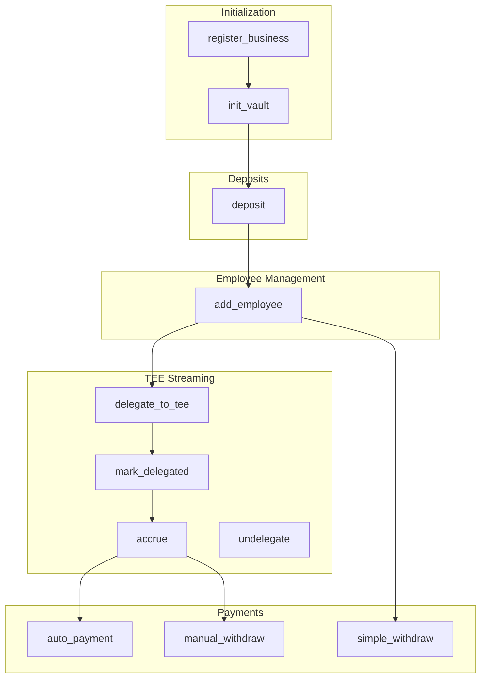
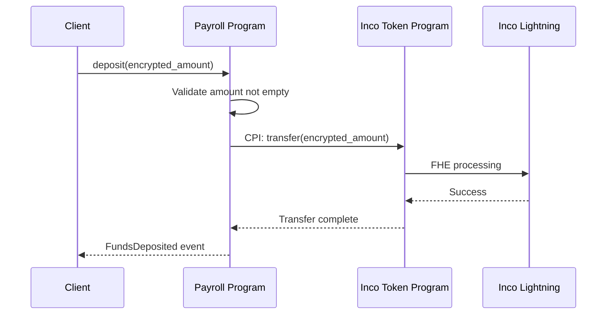
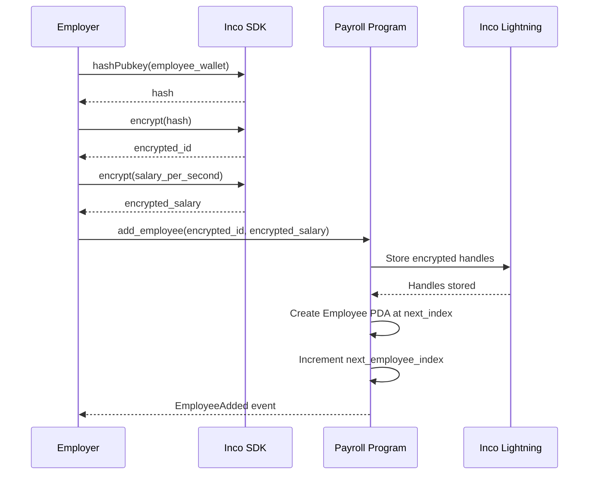
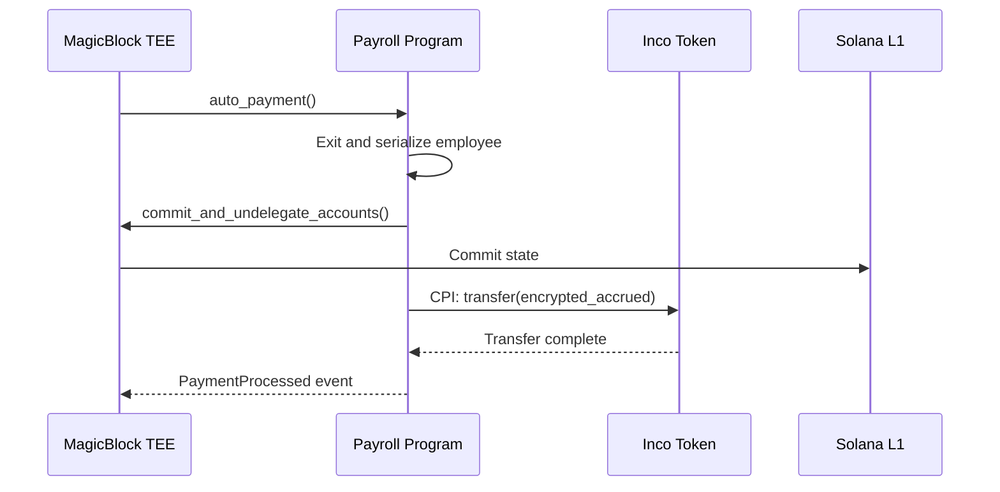

# Payroll Program Instructions

Complete reference for all Payroll Program instructions.

## Instruction Overview



---

## register_business

Registers a new business entity for the calling wallet.

### Signature

```rust
pub fn register_business(ctx: Context<RegisterBusiness>) -> Result<()>
```

### Accounts

| Account | Type | Description |
|---------|------|-------------|
| `owner` | `Signer` | Business owner wallet |
| `business` | `Account<Business>` | PDA to create |
| `system_program` | `Program<System>` | System program |

### Constraints

- Owner must be signer
- Business PDA must not already exist

### Example

```typescript
const [businessPda] = PublicKey.findProgramAddressSync(
  [Buffer.from('business'), wallet.publicKey.toBuffer()],
  PAYROLL_PROGRAM_ID
);

await program.methods
  .registerBusiness()
  .accounts({
    owner: wallet.publicKey,
    business: businessPda,
    systemProgram: SystemProgram.programId,
  })
  .rpc();
```

### Events

```rust
#[event]
pub struct BusinessRegistered {
    pub business_index: u64,
    pub timestamp: i64,
}
```

---

## init_vault

Initializes the business vault with token custody.

### Signature

```rust
pub fn init_vault(
    ctx: Context<InitVault>,
    usdbagel_mint: Pubkey,
    vault_token_account: Pubkey,
) -> Result<()>
```

### Arguments

| Arg | Type | Description |
|-----|------|-------------|
| `usdbagel_mint` | `Pubkey` | USDBagel token mint |
| `vault_token_account` | `Pubkey` | Inco Token Account (pre-created) |

### Accounts

| Account | Type | Description |
|---------|------|-------------|
| `owner` | `Signer` | Business owner |
| `business` | `Account<Business>` | Business account |
| `vault` | `Account<BusinessVault>` | PDA to create |
| `system_program` | `Program<System>` | System program |

### Prerequisites

The vault token account must be created externally via the Inco Token Program **before** calling this instruction. The vault PDA should be set as the owner of that token account.

### Example

```typescript
// Step 1: Create Inco Token Account (external)
// vault PDA set as owner during creation

const [vaultPda] = PublicKey.findProgramAddressSync(
  [Buffer.from('vault'), businessPda.toBuffer()],
  PAYROLL_PROGRAM_ID
);

// Step 2: Initialize vault
await program.methods
  .initVault(USDBAGEL_MINT, vaultTokenAccount)
  .accounts({
    owner: wallet.publicKey,
    business: businessPda,
    vault: vaultPda,
    systemProgram: SystemProgram.programId,
  })
  .rpc();
```

### Events

```rust
#[event]
pub struct VaultInitialized {
    pub business: Pubkey,
    pub vault: Pubkey,
    pub timestamp: i64,
}
```

---

## deposit

Deposits encrypted funds to the business vault.

### Signature

```rust
pub fn deposit(
    ctx: Context<Deposit>,
    encrypted_amount: Vec<u8>,
) -> Result<()>
```

### Arguments

| Arg | Type | Description |
|-----|------|-------------|
| `encrypted_amount` | `Vec<u8>` | Hex-encoded encrypted amount |

### Accounts

| Account | Type | Description |
|---------|------|-------------|
| `owner` | `Signer` | Depositor (business owner) |
| `business` | `Account<Business>` | Business account |
| `vault` | `Account<BusinessVault>` | Business vault |
| `depositor_token_account` | `AccountInfo` | Source Inco token account |
| `vault_token_account` | `AccountInfo` | Destination vault token account |
| `inco_token_program` | `AccountInfo` | Inco Token Program |
| `inco_lightning_program` | `AccountInfo` | Inco Lightning Program |
| `system_program` | `Program<System>` | System program |

### Constraints

- `encrypted_amount` must not be empty
- Owner must sign
- Depositor token account must have sufficient balance

### CPI Flow



### Example

```typescript
const encryptedAmount = await incoClient.encrypt(1_000_000_000n);

await program.methods
  .deposit(Buffer.from(encryptedAmount))
  .accounts({
    owner: wallet.publicKey,
    business: businessPda,
    vault: vaultPda,
    depositorTokenAccount: ownerTokenAccount,
    vaultTokenAccount: vaultTokenAccount,
    incoTokenProgram: INCO_TOKEN_PROGRAM_ID,
    incoLightningProgram: INCO_LIGHTNING_ID,
    systemProgram: SystemProgram.programId,
  })
  .rpc();
```

### Events

```rust
#[event]
pub struct FundsDeposited {
    pub business: Pubkey,
    pub timestamp: i64,
    // NOTE: No amount exposed for privacy
}
```

---

## add_employee

Adds an employee with encrypted identity and salary.

### Signature

```rust
pub fn add_employee(
    ctx: Context<AddEmployee>,
    encrypted_employee_id: Vec<u8>,
    encrypted_salary_rate: Vec<u8>,
) -> Result<()>
```

### Arguments

| Arg | Type | Description |
|-----|------|-------------|
| `encrypted_employee_id` | `Vec<u8>` | E(hash(employee_wallet)) |
| `encrypted_salary_rate` | `Vec<u8>` | E(salary_per_second) |

### Accounts

| Account | Type | Description |
|---------|------|-------------|
| `owner` | `Signer` | Business owner |
| `business` | `Account<Business>` | Business account |
| `employee` | `Account<Employee>` | PDA to create |
| `inco_lightning_program` | `AccountInfo` | Inco Lightning Program |
| `system_program` | `Program<System>` | System program |

### Constraints

- `encrypted_employee_id` must not be empty
- `encrypted_salary_rate` must not be empty
- Owner must sign

### Privacy Flow



### Example

```typescript
// Hash and encrypt employee identity
const employeeHash = await incoClient.hashPubkey(employeeWallet);
const encryptedId = await incoClient.encrypt(employeeHash);

// Encrypt salary (per second)
const monthlySalary = 10_000_000_000n; // $10,000 in base units
const salaryPerSecond = monthlySalary / BigInt(30 * 24 * 3600);
const encryptedSalary = await incoClient.encrypt(salaryPerSecond);

const employeeIndex = business.nextEmployeeIndex;
const [employeePda] = PublicKey.findProgramAddressSync(
  [
    Buffer.from('employee'),
    businessPda.toBuffer(),
    new BN(employeeIndex).toArrayLike(Buffer, 'le', 8),
  ],
  PAYROLL_PROGRAM_ID
);

await program.methods
  .addEmployee(Buffer.from(encryptedId), Buffer.from(encryptedSalary))
  .accounts({
    owner: wallet.publicKey,
    business: businessPda,
    employee: employeePda,
    incoLightningProgram: INCO_LIGHTNING_ID,
    systemProgram: SystemProgram.programId,
  })
  .rpc();
```

### Events

```rust
#[event]
pub struct EmployeeAdded {
    pub employee_index: u64,
    pub timestamp: i64,
    // NOTE: No identity or salary exposed
}
```

---

## delegate_to_tee

Delegates employee entry to MagicBlock TEE for real-time streaming.

### Signature

```rust
#[delegate]
pub fn delegate_to_tee(ctx: Context<DelegateToTee>) -> Result<()>
```

### Accounts

| Account | Type | Description |
|---------|------|-------------|
| `payer` | `Signer` | Transaction payer |
| `business` | `Account<Business>` | Business account |
| `employee` | `Account<Employee>` | Employee to delegate |
| `validator` | `AccountInfo` | TEE validator (optional) |
| `system_program` | `Program<System>` | System program |

### Constraints

- Employee must be active
- Employee must not already be delegated

### Default Validator

```rust
pub const TEE_VALIDATOR: &str = "FnE6VJT5QNZdedZPnCoLsARgBwoE6DeJNjBs2H1gySXA";
```

### Example

```typescript
await program.methods
  .delegateToTee()
  .accounts({
    payer: wallet.publicKey,
    business: businessPda,
    employee: employeePda,
    validator: TEE_VALIDATOR,
    systemProgram: SystemProgram.programId,
  })
  .rpc();
```

### Events

```rust
#[event]
pub struct DelegatedToTee {
    pub employee_index: u64,
    pub validator: Pubkey,
    pub timestamp: i64,
}
```

---

## accrue

Updates salary accrual for delegated employee (called by TEE).

### Signature

```rust
pub fn accrue(ctx: Context<Accrue>) -> Result<()>
```

### Accounts

| Account | Type | Description |
|---------|------|-------------|
| `payer` | `Signer` | Transaction payer |
| `business` | `Account<Business>` | Business account |
| `employee` | `Account<Employee>` | Employee entry |
| `inco_lightning_program` | `AccountInfo` | Inco Lightning Program |

### Calculation

```rust
// Encrypted calculation via Inco Lightning
elapsed = current_time - last_accrual_time
new_accrued = e_add(encrypted_accrued, e_mul(encrypted_salary_rate, elapsed))
```

### TEE Context

This instruction is typically called by the MagicBlock TEE every ~10ms to provide real-time salary accrual.

---

## auto_payment

TEE-triggered automatic payment of accrued salary.

### Signature

```rust
#[commit]
pub fn auto_payment(ctx: Context<AutoPayment>) -> Result<()>
```

### Accounts

| Account | Type | Description |
|---------|------|-------------|
| `payer` | `Signer` | Transaction payer |
| `business` | `Account<Business>` | Business account |
| `vault` | `Account<BusinessVault>` | Business vault |
| `employee` | `Account<Employee>` | Employee entry |
| `vault_token_account` | `AccountInfo` | Vault token account |
| `employee_token_account` | `AccountInfo` | Employee token account |
| `inco_token_program` | `AccountInfo` | Inco Token Program |
| `inco_lightning_program` | `AccountInfo` | Inco Lightning Program |
| `magic_context` | `AccountInfo` | MagicBlock context |
| `magic_program` | `AccountInfo` | MagicBlock program |
| `system_program` | `Program<System>` | System program |

### Flow



### Events

```rust
#[event]
pub struct PaymentProcessed {
    pub employee_index: u64,
    pub timestamp: i64,
    pub auto_payment: true,
}
```

---

## manual_withdraw

Employee-initiated withdrawal with TEE state commit.

### Signature

```rust
#[commit]
pub fn manual_withdraw(
    ctx: Context<ManualWithdraw>,
    encrypted_amount: Vec<u8>,
) -> Result<()>
```

### Arguments

| Arg | Type | Description |
|-----|------|-------------|
| `encrypted_amount` | `Vec<u8>` | Encrypted withdrawal amount |

### Accounts

| Account | Type | Description |
|---------|------|-------------|
| `employee_signer` | `Signer` | Employee wallet (identity verification) |
| `business` | `Account<Business>` | Business account |
| `vault` | `Account<BusinessVault>` | Business vault |
| `employee` | `Account<Employee>` | Employee entry |
| `vault_token_account` | `AccountInfo` | Vault token account |
| `employee_token_account` | `AccountInfo` | Employee token account |
| `inco_token_program` | `AccountInfo` | Inco Token Program |
| `inco_lightning_program` | `AccountInfo` | Inco Lightning Program |
| `magic_context` | `AccountInfo` | MagicBlock context |
| `magic_program` | `AccountInfo` | MagicBlock program |
| `system_program` | `Program<System>` | System program |

### Constraints

- Employee must sign (identity verification)
- Employee must be active
- If delegated, commits and undelegates first

### Example

```typescript
const encryptedAmount = await incoClient.encrypt(withdrawAmount);

await program.methods
  .manualWithdraw(Buffer.from(encryptedAmount))
  .accounts({
    employeeSigner: employeeWallet.publicKey,
    business: businessPda,
    vault: vaultPda,
    employee: employeePda,
    vaultTokenAccount: vaultTokenAccount,
    employeeTokenAccount: employeeTokenAccount,
    incoTokenProgram: INCO_TOKEN_PROGRAM_ID,
    incoLightningProgram: INCO_LIGHTNING_ID,
    magicContext: magicContextPda,
    magicProgram: MAGICBLOCK_PROGRAM_ID,
    systemProgram: SystemProgram.programId,
  })
  .signers([employeeWallet])
  .rpc();
```

---

## simple_withdraw

Direct withdrawal without TEE (useful for testing or non-streaming mode).

### Signature

```rust
pub fn simple_withdraw(
    ctx: Context<SimpleWithdraw>,
    encrypted_amount: Vec<u8>,
) -> Result<()>
```

### Arguments

| Arg | Type | Description |
|-----|------|-------------|
| `encrypted_amount` | `Vec<u8>` | Encrypted withdrawal amount |

### Accounts

| Account | Type | Description |
|---------|------|-------------|
| `employee_signer` | `Signer` | Employee wallet |
| `business` | `Account<Business>` | Business account |
| `vault` | `Account<BusinessVault>` | Business vault |
| `employee` | `Account<Employee>` | Employee entry |
| `vault_token_account` | `AccountInfo` | Vault token account |
| `employee_token_account` | `AccountInfo` | Employee token account |
| `inco_token_program` | `AccountInfo` | Inco Token Program |
| `inco_lightning_program` | `AccountInfo` | Inco Lightning Program |
| `system_program` | `Program<System>` | System program |

### Example

```typescript
const encryptedAmount = await incoClient.encrypt(withdrawAmount);

await program.methods
  .simpleWithdraw(Buffer.from(encryptedAmount))
  .accounts({
    employeeSigner: employeeWallet.publicKey,
    business: businessPda,
    vault: vaultPda,
    employee: employeePda,
    vaultTokenAccount: vaultTokenAccount,
    employeeTokenAccount: employeeTokenAccount,
    incoTokenProgram: INCO_TOKEN_PROGRAM_ID,
    incoLightningProgram: INCO_LIGHTNING_ID,
    systemProgram: SystemProgram.programId,
  })
  .signers([employeeWallet])
  .rpc();
```

---

## Error Codes

| Code | Name | Description |
|------|------|-------------|
| 6000 | InvalidAmount | Encrypted amount is empty |
| 6001 | InvalidCiphertext | Malformed ciphertext |
| 6002 | InvalidTimestamp | Clock error |
| 6003 | InactiveEmployee | Employee is not active |
| 6004 | AlreadyDelegated | Employee already delegated to TEE |
| 6005 | NotDelegated | Employee not delegated to TEE |
| 6006 | InsufficientFunds | Vault balance too low |
| 6007 | Unauthorized | Signer not authorized |

## Next Steps

- [Employee Lifecycle](./employee-lifecycle) - Complete employee flows
- [Vault Integration](./vault-integration) - Token custody details
