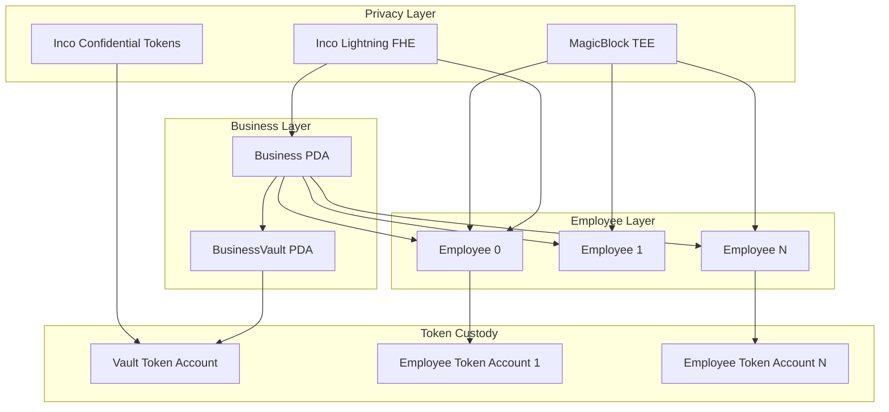

# Payroll Program Overview

Comprehensive documentation of the Bagel Payroll Program for privacy-preserving salary management.

## Program Information

| Attribute | Value |
|-----------|-------|
| Program ID | `J11xMm4pLQ6BUEhTpNwF1Mh4UhzUJNZCcw52zvZJspK2` |
| Framework | Anchor 0.32.1 |
| Network | Devnet (Mainnet planned) |

## Purpose

The Payroll Program provides a complete privacy-preserving payroll system with:

- **Encrypted Salaries**: Salary rates stored as FHE ciphertexts
- **Confidential Transfers**: All deposits and withdrawals use encrypted amounts
- **Identity Privacy**: Index-based PDAs prevent identity correlation
- **Real-Time Streaming**: MagicBlock TEE integration for continuous accrual
- **Per-Business Vaults**: Modular architecture with isolated business funds

## Architecture



## Key Design Principles

### 1. Per-Business Isolation

Each business has its own vault with isolated funds:

```rust
// Business PDA: One per owner
seeds = ["business", owner.pubkey]

// Vault PDA: One per business
seeds = ["vault", business.pubkey]
```

This ensures clear fund separation and simplified accounting.

### 2. Index-Based Employee PDAs

Employee identities are protected through index-based PDA derivation:

```rust
// Privacy-preserving PDA (no employee pubkey in seeds)
seeds = ["employee", business.pubkey, employee_index]

// Employee identity stored encrypted
encrypted_employee_id: EncryptedHandle  // E(hash(employee_wallet))
```

On-chain observers cannot determine which wallet belongs to which employee.

### 3. Encrypted Handle Storage

All sensitive data is stored as 32-byte handles referencing Inco ciphertexts:

```rust
pub struct EncryptedHandle {
    pub handle: [u8; 32],
}
```

The actual encrypted values are stored and computed in the Inco Lightning system.

## Program Dependencies

| Program | ID | Purpose |
|---------|----|----|
| Inco Lightning | `5sjEbPiqgZrYwR31ahR6Uk9wf5awoX61YGg7jExQSwaj` | FHE operations |
| Inco Token | `4cyJHzecVWuU2xux6bCAPAhALKQT8woBh4Vx3AGEGe5N` | Encrypted transfers |
| MagicBlock | `DELeGGvXpWV2fqJUhqcF5ZSYMS4JTLjteaAMARRSaeSh` | TEE streaming |
| System Program | `11111111111111111111111111111111` | Account creation |

## Instruction Categories

### Initialization

| Instruction | Purpose |
|-------------|---------|
| `register_business` | Register a new business entity |
| `init_vault` | Initialize business vault with token custody |

### Deposits

| Instruction | Purpose |
|-------------|---------|
| `deposit` | Deposit encrypted funds to vault |

### Employee Management

| Instruction | Purpose |
|-------------|---------|
| `add_employee` | Add employee with encrypted identity and salary |

### TEE Streaming

| Instruction | Purpose |
|-------------|---------|
| `delegate_to_tee` | Delegate employee to MagicBlock TEE |
| `mark_delegated` | Mark employee as delegated |
| `accrue` | Update salary accrual (TEE-called) |
| `undelegate` | Remove employee from TEE |

### Withdrawals

| Instruction | Purpose |
|-------------|---------|
| `auto_payment` | TEE-triggered automatic payment |
| `manual_withdraw` | Employee-initiated withdrawal with TEE commit |
| `simple_withdraw` | Direct withdrawal without TEE |

## Privacy Guarantees

| Data | Protection Method | Visibility |
|------|-------------------|------------|
| Salary amounts | FHE (Euint128) | Never visible |
| Employee identity | Encrypted hash | Never visible |
| Accrued balance | FHE (Euint128) | Never visible |
| Business identity | Encrypted hash | Never visible |
| Employee count | FHE (Euint128) | Never visible |
| Transfer amounts | Confidential tokens | Never visible |

## Events

All events are privacy-preserving with no sensitive data exposed:

```rust
pub struct BusinessRegistered {
    pub business_index: u64,  // Only index, no identity
    pub timestamp: i64,
}

pub struct EmployeeAdded {
    pub employee_index: u64,  // Only index, no identity
    pub timestamp: i64,
}

pub struct PaymentProcessed {
    pub employee_index: u64,  // Only index
    pub timestamp: i64,
    pub auto_payment: bool,   // No amount
}
```

## Quick Start

### 1. Register Business

```typescript
const [businessPda] = PublicKey.findProgramAddressSync(
  [Buffer.from('business'), owner.toBuffer()],
  PAYROLL_PROGRAM_ID
);

await program.methods
  .registerBusiness()
  .accounts({
    owner: wallet.publicKey,
    business: businessPda,
    systemProgram: SystemProgram.programId,
  })
  .rpc();
```

### 2. Initialize Vault

```typescript
const [vaultPda] = PublicKey.findProgramAddressSync(
  [Buffer.from('vault'), businessPda.toBuffer()],
  PAYROLL_PROGRAM_ID
);

await program.methods
  .initVault(USDBAGEL_MINT, vaultTokenAccount)
  .accounts({
    owner: wallet.publicKey,
    business: businessPda,
    vault: vaultPda,
    systemProgram: SystemProgram.programId,
  })
  .rpc();
```

### 3. Add Employee

```typescript
const encryptedId = await incoClient.encrypt(hashPubkey(employeeWallet));
const encryptedSalary = await incoClient.encrypt(salaryPerSecond);

await program.methods
  .addEmployee(Buffer.from(encryptedId), Buffer.from(encryptedSalary))
  .accounts({
    owner: wallet.publicKey,
    business: businessPda,
    employee: employeePda,
    incoLightningProgram: INCO_LIGHTNING_ID,
    systemProgram: SystemProgram.programId,
  })
  .rpc();
```

## Next Steps

- [Account Structures](./accounts) - Detailed account layouts
- [Instructions Reference](./instructions) - Complete instruction documentation
- [Employee Lifecycle](./employee-lifecycle) - Employee management flows
- [Vault Integration](./vault-integration) - Token custody and transfers
