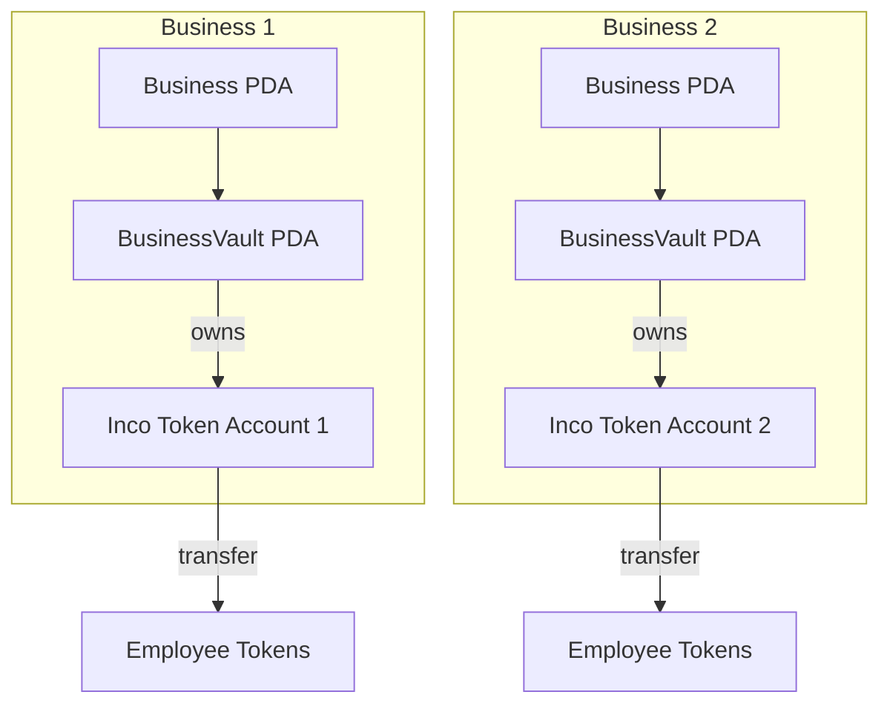
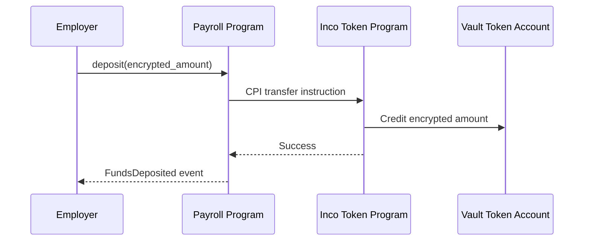
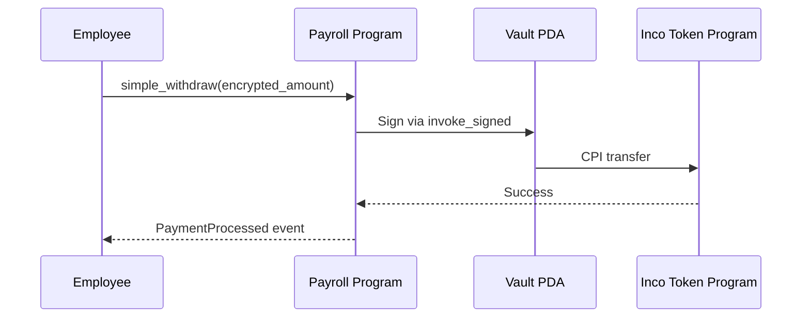

# Vault Integration

Guide to vault token custody and transfer mechanics in the Payroll Program.

## Vault Architecture

The Payroll Program uses a per-business vault model where each business has isolated token custody.



## Token Account Setup

### Step 1: Create Vault Token Account

The vault token account must be created via the Inco Token Program **before** initializing the vault:

```typescript
import { Keypair } from '@solana/web3.js';

// Generate keypair for vault token account
const vaultTokenAccountKeypair = Keypair.generate();

// Derive vault PDA (will be owner of token account)
const [vaultPda] = PublicKey.findProgramAddressSync(
  [Buffer.from('vault'), businessPda.toBuffer()],
  PAYROLL_PROGRAM_ID
);

// Create Inco Token Account with vault PDA as owner
const INCO_TOKEN_PROGRAM_ID = new PublicKey('4cyJHzecVWuU2xux6bCAPAhALKQT8woBh4Vx3AGEGe5N');

const initAccountIx = new TransactionInstruction({
  keys: [
    { pubkey: vaultTokenAccountKeypair.publicKey, isSigner: true, isWritable: true },
    { pubkey: USDBAGEL_MINT, isSigner: false, isWritable: false },
    { pubkey: vaultPda, isSigner: false, isWritable: false },  // Owner = Vault PDA
    { pubkey: payerWallet.publicKey, isSigner: true, isWritable: true },
    { pubkey: SystemProgram.programId, isSigner: false, isWritable: false },
  ],
  programId: INCO_TOKEN_PROGRAM_ID,
  data: Buffer.from([/* initialize_account discriminator */]),
});

await sendAndConfirmTransaction(
  connection,
  new Transaction().add(initAccountIx),
  [payerWallet, vaultTokenAccountKeypair]
);
```

### Step 2: Initialize BusinessVault

```typescript
await program.methods
  .initVault(USDBAGEL_MINT, vaultTokenAccount)
  .accounts({
    owner: wallet.publicKey,
    business: businessPda,
    vault: vaultPda,
    systemProgram: SystemProgram.programId,
  })
  .rpc();
```

## Deposit Flow



```typescript
const encryptedAmount = await incoClient.encrypt(1_000_000_000n);

await program.methods
  .deposit(Buffer.from(encryptedAmount))
  .accounts({
    owner: wallet.publicKey,
    business: businessPda,
    vault: vaultPda,
    depositorTokenAccount: ownerTokenAccount,
    vaultTokenAccount: vaultTokenAccount,
    incoTokenProgram: INCO_TOKEN_PROGRAM_ID,
    incoLightningProgram: INCO_LIGHTNING_ID,
    systemProgram: SystemProgram.programId,
  })
  .rpc();
```

## Withdrawal Flow

The vault PDA signs withdrawal transfers using `invoke_signed`:

```rust
let vault_seeds: &[&[&[u8]]] = &[&[
    b"vault",
    business.key().as_ref(),
    &[vault.bump],
]];

invoke_signed(&transfer_ix, &[/* accounts */], vault_seeds)?;
```



## Token Configuration

### USDBagel Token

| Attribute | Value |
|-----------|-------|
| Mint Address | `GhCZ59UK4Afg4WGpQ11HyRc8ya4swgWFXMh2BxuWQXHt` |
| Decimals | 9 |

For employee token account setup, see [Employee Lifecycle - Token Account Setup](./employee-lifecycle#token-account-setup).

## Balance Management

All balance updates use homomorphic operations:

```
Deposit:  vault.balance = e_add(vault.balance, encrypted_deposit)
Withdraw: vault.balance = e_sub(vault.balance, encrypted_withdrawal)
```

### Checking Vault Balance

```typescript
const vault = await program.account.businessVault.fetch(vaultPda);
const balance = await incoClient.decrypt(vault.encryptedBalance, authorizedWallet);
console.log(`Vault balance: ${balance / 1_000_000_000n} USDBagel`);
```

## Security

| Operation | Signer | Authorization |
|-----------|--------|---------------|
| Deposit | Owner wallet | Must own depositor token account |
| Withdrawal | Vault PDA | Program-controlled via `invoke_signed` |

### Confidential Token Guarantees

| Guarantee | Implementation |
|-----------|----------------|
| Amount privacy | All amounts encrypted via FHE |
| Transfer integrity | Inco Token Program verification |
| Balance consistency | Homomorphic arithmetic |

## Troubleshooting

| Issue | Solution |
|-------|----------|
| Invalid token account owner | Ensure vault PDA is set as owner during creation |
| Insufficient funds | Check vault balance, deposit more funds |
| CPI transfer failed | Verify token accounts exist and signer authorities |

## Next Steps

- [Employee Lifecycle](./employee-lifecycle) - Employee management flows
- [Instructions Reference](./instructions) - Complete instruction documentation
