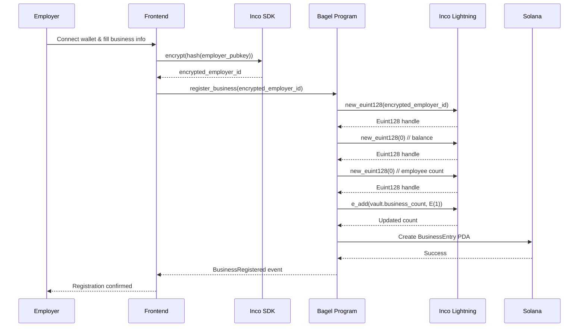
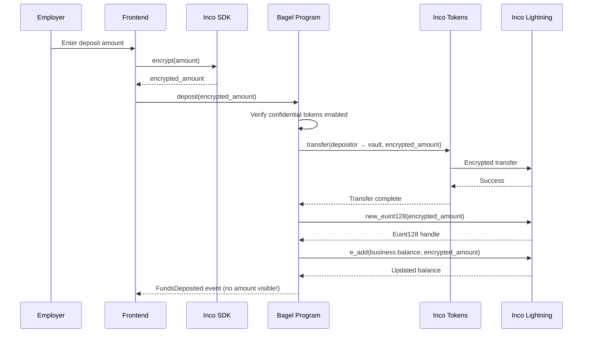
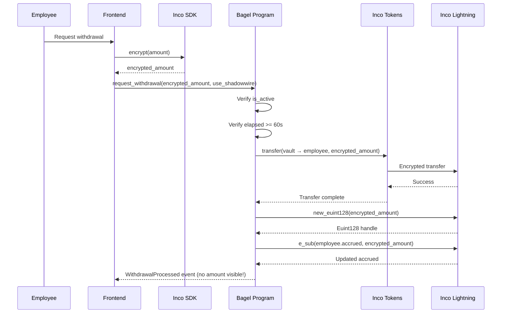
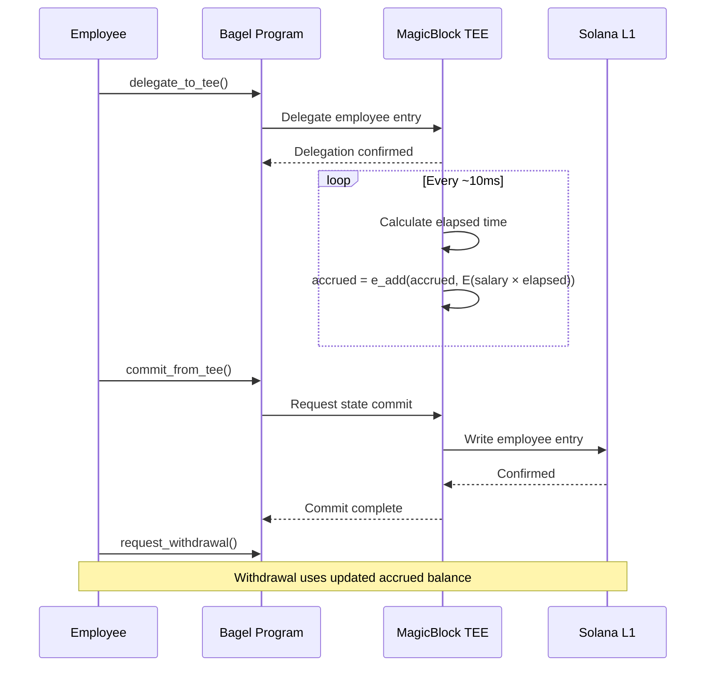

# Bagel Protocol Architecture

> Privacy-First Payroll Infrastructure on Solana with Fully Homomorphic Encryption (FHE)

---

## Table of Contents

1. [Executive Summary](#executive-summary)
2. [System Architecture](#system-architecture)
3. [Cryptographic Foundations](#cryptographic-foundations)
4. [Account Structures](#account-structures)
5. [Program Instructions](#program-instructions)
6. [Privacy Layer Integration](#privacy-layer-integration)
7. [Data Flow Diagrams](#data-flow-diagrams)
8. [Mathematical Models](#mathematical-models)
9. [Security Analysis](#security-analysis)
10. [Performance Characteristics](#performance-characteristics)
11. [Integration Guide](#integration-guide)

---

## Executive Summary

Bagel is a privacy-preserving payroll protocol built on Solana that leverages **Fully Homomorphic Encryption (FHE)** via Inco Lightning to ensure complete confidentiality of salary data, account balances, and employee identities.

### Key Privacy Guarantees

| Data Type | Privacy Method | Observer Visibility |
|-----------|---------------|---------------------|
| Salary amounts | FHE (Euint128) | ❌ Encrypted |
| Account balances | FHE (Euint128) | ❌ Encrypted |
| Transfer amounts | Confidential Tokens | ❌ Encrypted |
| Employer identity | FHE + Index PDAs | ❌ Encrypted |
| Employee identity | FHE + Index PDAs | ❌ Encrypted |
| Business count | FHE (Euint128) | ❌ Encrypted |
| Employee count | FHE (Euint128) | ❌ Encrypted |
| Transaction signatures | On-chain | ✅ Public |
| Account addresses | On-chain | ✅ Public |

### Technology Stack

```
┌─────────────────────────────────────────────────────────────────────────────┐
│                              BAGEL PROTOCOL                                  │
├─────────────────────────────────────────────────────────────────────────────┤
│  ┌─────────────┐  ┌─────────────┐  ┌─────────────┐  ┌─────────────────────┐ │
│  │ Inco        │  │ Inco        │  │ MagicBlock  │  │ Helius              │ │
│  │ Lightning   │  │ Confidential│  │ TEE/PER     │  │ RPC + DAS           │ │
│  │ FHE Engine  │  │ Tokens      │  │ Streaming   │  │ Infrastructure      │ │
│  └─────────────┘  └─────────────┘  └─────────────┘  └─────────────────────┘ │
├─────────────────────────────────────────────────────────────────────────────┤
│                           SOLANA BLOCKCHAIN                                  │
│                    Devnet → Mainnet (Production)                            │
└─────────────────────────────────────────────────────────────────────────────┘
```

---

## System Architecture

### High-Level Overview

```
┌─────────────────────────────────────────────────────────────────────────────┐
│                           FRONTEND (Next.js 15)                              │
│  ┌─────────────────┐  ┌─────────────────┐  ┌─────────────────────────────┐  │
│  │ Wallet Adapter  │  │ Inco SDK        │  │ Real-time UI                │  │
│  │ (Phantom, etc.) │  │ (Encryption)    │  │ (Transaction Status)        │  │
│  └────────┬────────┘  └────────┬────────┘  └──────────────┬──────────────┘  │
└───────────┼────────────────────┼───────────────────────────┼────────────────┘
            │                    │                           │
            ▼                    ▼                           ▼
┌─────────────────────────────────────────────────────────────────────────────┐
│                         PRIVACY SDK LAYER                                    │
│  ┌─────────────────────────────────────────────────────────────────────────┐│
│  │                     Inco Lightning FHE                                   ││
│  │  • new_euint128()  - Create encrypted value                             ││
│  │  • e_add()         - Homomorphic addition                               ││
│  │  • e_sub()         - Homomorphic subtraction                            ││
│  │  • e_mul()         - Homomorphic multiplication                         ││
│  │  • decrypt()       - Authorized decryption                              ││
│  └─────────────────────────────────────────────────────────────────────────┘│
│  ┌───────────────────────────┐  ┌──────────────────────────────────────────┐│
│  │ Inco Confidential Tokens  │  │ MagicBlock Ephemeral Rollups             ││
│  │ • transfer()              │  │ • delegate_to_tee()                      ││
│  │ • encrypted amounts       │  │ • commit_and_undelegate()                ││
│  └───────────────────────────┘  └──────────────────────────────────────────┘│
└─────────────────────────────────────────────────────────────────────────────┘
            │                    │                           │
            ▼                    ▼                           ▼
┌─────────────────────────────────────────────────────────────────────────────┐
│                      BAGEL SOLANA PROGRAM (Anchor)                           │
│  Program ID: AEd52vEEAdXWUjKut1aQyLLJQnwMWqYMb4hSaHpxd8Hj                   │
│                                                                              │
│  ┌─────────────────┐  ┌─────────────────┐  ┌─────────────────────────────┐  │
│  │ MasterVault     │  │ BusinessEntry   │  │ EmployeeEntry               │  │
│  │ (Global Pool)   │  │ (Index-Based)   │  │ (Index-Based)               │  │
│  └─────────────────┘  └─────────────────┘  └─────────────────────────────┘  │
└─────────────────────────────────────────────────────────────────────────────┘
            │                    │                           │
            ▼                    ▼                           ▼
┌─────────────────────────────────────────────────────────────────────────────┐
│                           SOLANA BLOCKCHAIN                                  │
│                                                                              │
│  Network: Devnet (current) → Mainnet (production)                           │
│  RPC: Helius High-Performance Endpoints                                     │
│  Explorer: Solana Explorer / OrbMarkets                                     │
└─────────────────────────────────────────────────────────────────────────────┘
```

### Program IDs

| Program | ID | Network | Purpose |
|---------|---|---------|---------|
| **Bagel** | `AEd52vEEAdXWUjKut1aQyLLJQnwMWqYMb4hSaHpxd8Hj` | Devnet | Main payroll program |
| **Inco Lightning** | `5sjEbPiqgZrYwR31ahR6Uk9wf5awoX61YGg7jExQSwaj` | Devnet | FHE operations |
| **Inco Tokens** | `HuUn2JwCPCLWwJ3z17m7CER73jseqsxvbcFuZN4JAw22` | Devnet | Confidential transfers |
| **MagicBlock** | `DELeGGvXpWV2fqJUhqcF5ZSYMS4JTLjteaAMARRSaeSh` | Devnet | TEE delegation |

---

## Cryptographic Foundations

### Fully Homomorphic Encryption (FHE)

Bagel uses Inco Lightning's implementation of FHE based on the TFHE (Torus Fully Homomorphic Encryption) scheme. This allows computation on encrypted data without ever revealing the plaintext.

#### Euint128 Type

The core encrypted type is `Euint128` - a 128-bit encrypted unsigned integer:

```
┌────────────────────────────────────────────────────────────────┐
│                         Euint128                                │
├────────────────────────────────────────────────────────────────┤
│  handle: [u8; 16]  ─────▶  Points to encrypted ciphertext      │
│                            managed by Inco Lightning            │
└────────────────────────────────────────────────────────────────┘
```

**Memory Layout (16 bytes):**
```
Offset  Size   Field
──────  ────   ─────
0       16     handle (encrypted value reference)
```

### Homomorphic Operations

#### Addition: `e_add(a, b) → c`

Performs addition on encrypted values without decryption:

```
E(a) ⊕ E(b) = E(a + b)

Where:
  E(x) = Encryption function
  ⊕    = Homomorphic addition operation
```

**Mathematical Definition:**
```
Let E: ℤ → C be the encryption function
Let ⊕: C × C → C be the homomorphic add

∀ a,b ∈ ℤ₂¹²⁸: E(a) ⊕ E(b) = E((a + b) mod 2¹²⁸)
```

**CPI Call:**
```rust
let result: Euint128 = e_add(
    cpi_ctx,
    encrypted_a,  // Euint128
    encrypted_b,  // Euint128
    0,            // input_type (0 = ciphertext)
)?;
```

#### Subtraction: `e_sub(a, b) → c`

Performs subtraction on encrypted values:

```
E(a) ⊖ E(b) = E(a - b)

Where:
  ⊖ = Homomorphic subtraction operation
```

**Mathematical Definition:**
```
∀ a,b ∈ ℤ₂¹²⁸ where a ≥ b: E(a) ⊖ E(b) = E(a - b)
```

**CPI Call:**
```rust
let result: Euint128 = e_sub(
    cpi_ctx,
    encrypted_a,  // Euint128 (minuend)
    encrypted_b,  // Euint128 (subtrahend)
    0,            // input_type
)?;
```

#### Encryption: `new_euint128(value) → E(value)`

Creates a new encrypted value from plaintext (client-side) or ciphertext (on-chain):

```
new_euint128: Vec<u8> × u8 → Euint128

Where:
  Vec<u8> = Input bytes (plaintext or ciphertext)
  u8      = Input type (0 = ciphertext, 1 = plaintext)
```

**CPI Call:**
```rust
let encrypted: Euint128 = new_euint128(
    cpi_ctx,
    ciphertext_bytes,  // Vec<u8>
    0,                 // input_type
)?;
```

### Privacy-Preserving PDA Derivation

Traditional PDAs leak identity through seeds. Bagel uses **index-based PDAs**:

```
┌─────────────────────────────────────────────────────────────────────────────┐
│                    TRADITIONAL (INSECURE)                                    │
│                                                                              │
│  Seeds: ["employee", business_pubkey, employee_pubkey]                      │
│                            │                │                                │
│                            ▼                ▼                                │
│                    ⚠️ LEAKED          ⚠️ LEAKED                              │
│                    Business ID        Employee ID                            │
└─────────────────────────────────────────────────────────────────────────────┘

┌─────────────────────────────────────────────────────────────────────────────┐
│                      BAGEL (PRIVATE)                                         │
│                                                                              │
│  Seeds: ["employee", business_pda, employee_index]                          │
│                            │                │                                │
│                            ▼                ▼                                │
│                       ✅ PDA            ✅ Integer                           │
│                       (opaque)          (no identity)                        │
│                                                                              │
│  Identity stored as: E(hash(pubkey)) ──▶ Only owner can decrypt             │
└─────────────────────────────────────────────────────────────────────────────┘
```

**Seed Structures:**

| Account | Seeds | Privacy |
|---------|-------|---------|
| MasterVault | `["master_vault"]` | Global, no identity |
| BusinessEntry | `["entry", master_vault, index]` | Index-based, no pubkey |
| EmployeeEntry | `["employee", business_pda, index]` | Index-based, no pubkey |
| UserTokenAccount | `["user_token", wallet, mint]` | Deterministic lookup |

---

## Account Structures

### MasterVault

The global pool that holds all funds. All business accounting is internal via encrypted state.

```
┌──────────────────────────────────────────────────────────────────────────────┐
│                            MasterVault                                        │
│                          Total Size: 162 bytes                                │
├──────────────────────────────────────────────────────────────────────────────┤
│ Offset │ Size │ Field                      │ Type     │ Visibility           │
├────────┼──────┼────────────────────────────┼──────────┼──────────────────────┤
│ 0      │ 8    │ discriminator              │ [u8; 8]  │ Public (Anchor)      │
│ 8      │ 32   │ authority                  │ Pubkey   │ Public               │
│ 40     │ 8    │ total_balance              │ u64      │ Public (unavoidable) │
│ 48     │ 16   │ encrypted_business_count   │ Euint128 │ 🔒 ENCRYPTED         │
│ 64     │ 16   │ encrypted_employee_count   │ Euint128 │ 🔒 ENCRYPTED         │
│ 80     │ 8    │ next_business_index        │ u64      │ Public (counter)     │
│ 88     │ 1    │ is_active                  │ bool     │ Public               │
│ 89     │ 1    │ bump                       │ u8       │ Public               │
│ 90     │ 32   │ confidential_mint          │ Pubkey   │ Public               │
│ 122    │ 1    │ use_confidential_tokens    │ bool     │ Public               │
│ 123    │ 39   │ padding                    │ [u8]     │ Reserved             │
└────────┴──────┴────────────────────────────┴──────────┴──────────────────────┘
```

**Rust Definition:**
```rust
#[account]
pub struct MasterVault {
    pub authority: Pubkey,                      // 32 bytes
    pub total_balance: u64,                     // 8 bytes
    pub encrypted_business_count: Euint128,     // 16 bytes 🔒
    pub encrypted_employee_count: Euint128,     // 16 bytes 🔒
    pub next_business_index: u64,               // 8 bytes
    pub is_active: bool,                        // 1 byte
    pub bump: u8,                               // 1 byte
    pub confidential_mint: Pubkey,              // 32 bytes
    pub use_confidential_tokens: bool,          // 1 byte
}
```

### BusinessEntry

Represents a registered business using index-based PDA derivation.

```
┌──────────────────────────────────────────────────────────────────────────────┐
│                           BusinessEntry                                       │
│                          Total Size: 138 bytes                                │
├──────────────────────────────────────────────────────────────────────────────┤
│ Offset │ Size │ Field                      │ Type     │ Visibility           │
├────────┼──────┼────────────────────────────┼──────────┼──────────────────────┤
│ 0      │ 8    │ discriminator              │ [u8; 8]  │ Public (Anchor)      │
│ 8      │ 32   │ master_vault               │ Pubkey   │ Public               │
│ 40     │ 8    │ entry_index                │ u64      │ Public (opaque)      │
│ 48     │ 16   │ encrypted_employer_id      │ Euint128 │ 🔒 ENCRYPTED         │
│ 64     │ 16   │ encrypted_balance          │ Euint128 │ 🔒 ENCRYPTED         │
│ 80     │ 16   │ encrypted_employee_count   │ Euint128 │ 🔒 ENCRYPTED         │
│ 96     │ 8    │ next_employee_index        │ u64      │ Public (counter)     │
│ 104    │ 1    │ is_active                  │ bool     │ Public               │
│ 105    │ 1    │ bump                       │ u8       │ Public               │
│ 106    │ 32   │ padding                    │ [u8]     │ Reserved             │
└────────┴──────┴────────────────────────────┴──────────┴──────────────────────┘
```

**PDA Derivation:**
```rust
seeds = [b"entry", master_vault.key().as_ref(), &entry_index.to_le_bytes()]
```

### EmployeeEntry

Represents an employee with encrypted salary and accrued balance.

```
┌──────────────────────────────────────────────────────────────────────────────┐
│                           EmployeeEntry                                       │
│                          Total Size: 138 bytes                                │
├──────────────────────────────────────────────────────────────────────────────┤
│ Offset │ Size │ Field                      │ Type     │ Visibility           │
├────────┼──────┼────────────────────────────┼──────────┼──────────────────────┤
│ 0      │ 8    │ discriminator              │ [u8; 8]  │ Public (Anchor)      │
│ 8      │ 32   │ business_entry             │ Pubkey   │ Public               │
│ 40     │ 8    │ employee_index             │ u64      │ Public (opaque)      │
│ 48     │ 16   │ encrypted_employee_id      │ Euint128 │ 🔒 ENCRYPTED         │
│ 64     │ 16   │ encrypted_salary           │ Euint128 │ 🔒 ENCRYPTED         │
│ 80     │ 16   │ encrypted_accrued          │ Euint128 │ 🔒 ENCRYPTED         │
│ 96     │ 8    │ last_action                │ i64      │ Public               │
│ 104    │ 1    │ is_active                  │ bool     │ Public               │
│ 105    │ 1    │ bump                       │ u8       │ Public               │
│ 106    │ 32   │ padding                    │ [u8]     │ Reserved             │
└────────┴──────┴────────────────────────────┴──────────┴──────────────────────┘
```

**PDA Derivation:**
```rust
seeds = [b"employee", business_entry.key().as_ref(), &employee_index.to_le_bytes()]
```

### UserTokenAccount

PDA-based token account registry for deterministic address lookup.

```
┌──────────────────────────────────────────────────────────────────────────────┐
│                          UserTokenAccount                                     │
│                          Total Size: 160 bytes                                │
├──────────────────────────────────────────────────────────────────────────────┤
│ Offset │ Size │ Field                      │ Type     │ Visibility           │
├────────┼──────┼────────────────────────────┼──────────┼──────────────────────┤
│ 0      │ 8    │ discriminator              │ [u8; 8]  │ Public (Anchor)      │
│ 8      │ 32   │ owner                      │ Pubkey   │ Public               │
│ 40     │ 32   │ mint                       │ Pubkey   │ Public               │
│ 72     │ 32   │ inco_token_account         │ Pubkey   │ Public               │
│ 104    │ 16   │ balance                    │ Euint128 │ 🔒 ENCRYPTED         │
│ 120    │ 8    │ initialized_at             │ i64      │ Public               │
│ 128    │ 1    │ bump                       │ u8       │ Public               │
│ 129    │ 31   │ padding                    │ [u8]     │ Reserved             │
└────────┴──────┴────────────────────────────┴──────────┴──────────────────────┘
```

**PDA Derivation:**
```rust
seeds = [b"user_token", owner.key().as_ref(), mint.key().as_ref()]
```

---

## Program Instructions

### Instruction Summary

```
┌─────────────────────────────────────────────────────────────────────────────┐
│                         BAGEL INSTRUCTIONS                                   │
├─────────────────────────────────────────────────────────────────────────────┤
│                                                                              │
│  VAULT MANAGEMENT                                                            │
│  ├── initialize_vault()      Create global master vault                     │
│  ├── migrate_vault()         Upgrade vault schema                           │
│  ├── configure_confidential_mint()  Set confidential token mint             │
│  └── close_vault()           Close vault (testing)                          │
│                                                                              │
│  BUSINESS OPERATIONS                                                         │
│  ├── register_business()     Register employer business                     │
│  └── deposit()               Deposit funds (confidential)                   │
│                                                                              │
│  EMPLOYEE OPERATIONS                                                         │
│  ├── add_employee()          Add employee with encrypted salary             │
│  └── request_withdrawal()    Withdraw accrued salary                        │
│                                                                              │
│  TEE STREAMING (MagicBlock)                                                  │
│  ├── delegate_to_tee()       Delegate to TEE for streaming                  │
│  └── commit_from_tee()       Commit TEE state to L1                         │
│                                                                              │
│  TOKEN ACCOUNTS                                                              │
│  ├── initialize_user_token_account()  Create PDA token account              │
│  ├── get_user_token_pda()    Query token PDA address                        │
│  └── set_inco_token_account()  Link Inco token account                      │
│                                                                              │
└─────────────────────────────────────────────────────────────────────────────┘
```

### initialize_vault

Creates the master vault (one-time global setup).

**Accounts:**
| Account | Type | Description |
|---------|------|-------------|
| authority | Signer | Program authority |
| master_vault | Account<MasterVault> | PDA to create |
| inco_lightning_program | AccountInfo | Inco Lightning program |
| system_program | Program | System program |

**Flow:**
```
Authority ──▶ Create MasterVault PDA
                    │
                    ├── Set authority
                    ├── Initialize total_balance = 0
                    ├── Initialize next_business_index = 0
                    ├── encrypted_business_count = E(0)  ◀── Inco CPI
                    └── encrypted_employee_count = E(0)  ◀── Inco CPI
```

### register_business

Registers a new business with encrypted employer identity.

**Arguments:**
| Arg | Type | Description |
|-----|------|-------------|
| encrypted_employer_id | Vec<u8> | E(hash(employer_pubkey)) |

**Flow:**
```
Employer ──▶ Get next_business_index from vault
                    │
                    ├── Create BusinessEntry PDA with index
                    ├── encrypted_employer_id = new_euint128(arg)
                    ├── encrypted_balance = E(0)
                    ├── encrypted_employee_count = E(0)
                    │
                    └── vault.encrypted_business_count = e_add(count, E(1))
```

**Privacy Guarantee:** No employer pubkey visible in PDA seeds or events.

### deposit

Deposits funds using confidential token transfer.

**Arguments:**
| Arg | Type | Description |
|-----|------|-------------|
| encrypted_amount | Vec<u8> | E(deposit_amount) |

**Flow:**
```
Depositor ──▶ Verify confidential tokens enabled
                    │
                    ├── Inco Token CPI: transfer(
                    │       source = depositor_token_account,
                    │       destination = master_vault_token_account,
                    │       amount = encrypted_amount
                    │   )
                    │
                    └── business.encrypted_balance = e_add(balance, E(amount))
```

**Privacy Guarantee:** Amount never visible on-chain, only encrypted ciphertext.

### add_employee

Adds an employee with encrypted identity and salary.

**Arguments:**
| Arg | Type | Description |
|-----|------|-------------|
| encrypted_employee_id | Vec<u8> | E(hash(employee_pubkey)) |
| encrypted_salary | Vec<u8> | E(salary_per_period) |

**Flow:**
```
Employer ──▶ Get next_employee_index from business
                    │
                    ├── Create EmployeeEntry PDA with index
                    ├── encrypted_employee_id = new_euint128(arg)
                    ├── encrypted_salary = new_euint128(arg)
                    ├── encrypted_accrued = E(0)
                    │
                    ├── business.encrypted_employee_count = e_add(count, E(1))
                    └── vault.encrypted_employee_count = e_add(count, E(1))
```

### request_withdrawal

Processes employee withdrawal with confidential transfer.

**Arguments:**
| Arg | Type | Description |
|-----|------|-------------|
| encrypted_amount | Vec<u8> | E(withdrawal_amount) |
| use_shadowwire | bool | Enable additional ZK privacy |

**Flow:**
```
Employee ──▶ Verify is_active
                    │
                    ├── Verify time elapsed >= MIN_WITHDRAW_INTERVAL (60s)
                    │
                    ├── Inco Token CPI: transfer(
                    │       source = master_vault_token_account,
                    │       destination = employee_token_account,
                    │       amount = encrypted_amount
                    │   )
                    │
                    ├── employee.encrypted_accrued = e_sub(accrued, E(amount))
                    │
                    └── Update last_action timestamp
```

### delegate_to_tee

Delegates employee entry to MagicBlock TEE for real-time streaming.

**Flow:**
```
Payer ──▶ delegate(
               account = employee_entry,
               validator = TEE_VALIDATOR,
               config = DelegateConfig
          )
              │
              └── Employee balance now updated in TEE every ~10ms
```

### commit_from_tee

Commits TEE state back to Solana L1.

**Flow:**
```
Payer ──▶ commit_and_undelegate_accounts(
               accounts = [employee_entry],
               magic_context,
               magic_program
          )
              │
              └── Employee accrued balance synced to L1
```

---

## Privacy Layer Integration

### Inco Lightning FHE

```
┌─────────────────────────────────────────────────────────────────────────────┐
│                         INCO LIGHTNING INTEGRATION                           │
├─────────────────────────────────────────────────────────────────────────────┤
│                                                                              │
│  Program ID: 5sjEbPiqgZrYwR31ahR6Uk9wf5awoX61YGg7jExQSwaj                   │
│  SDK Version: inco_lightning 0.1.4                                           │
│  Encryption: TFHE (Torus Fully Homomorphic Encryption)                       │
│                                                                              │
│  ┌─────────────────────────────────────────────────────────────────────────┐│
│  │ OPERATIONS                                                               ││
│  │                                                                          ││
│  │  new_euint128(bytes, type) ──▶ Euint128                                 ││
│  │      Creates encrypted value from ciphertext or plaintext               ││
│  │                                                                          ││
│  │  e_add(a, b, type) ──▶ Euint128                                         ││
│  │      Homomorphic: E(a) + E(b) = E(a + b)                                ││
│  │                                                                          ││
│  │  e_sub(a, b, type) ──▶ Euint128                                         ││
│  │      Homomorphic: E(a) - E(b) = E(a - b)                                ││
│  │                                                                          ││
│  │  e_mul(a, b, type) ──▶ Euint128                                         ││
│  │      Homomorphic: E(a) × E(b) = E(a × b)                                ││
│  │                                                                          ││
│  │  e_ge(a, b, type) ──▶ Ebool                                             ││
│  │      Homomorphic: E(a) >= E(b) = E(a >= b)                              ││
│  │                                                                          ││
│  └─────────────────────────────────────────────────────────────────────────┘│
│                                                                              │
│  ┌─────────────────────────────────────────────────────────────────────────┐│
│  │ CPI CONTEXT                                                              ││
│  │                                                                          ││
│  │  let cpi_accounts = Operation {                                         ││
│  │      signer: authority.to_account_info(),                               ││
│  │  };                                                                      ││
│  │  let cpi_ctx = CpiContext::new(inco_program, cpi_accounts);             ││
│  │  let result = e_add(cpi_ctx, encrypted_a, encrypted_b, 0)?;             ││
│  │                                                                          ││
│  └─────────────────────────────────────────────────────────────────────────┘│
└─────────────────────────────────────────────────────────────────────────────┘
```

### Inco Confidential Tokens

```
┌─────────────────────────────────────────────────────────────────────────────┐
│                      INCO CONFIDENTIAL TOKENS                                │
├─────────────────────────────────────────────────────────────────────────────┤
│                                                                              │
│  Program ID: HuUn2JwCPCLWwJ3z17m7CER73jseqsxvbcFuZN4JAw22                   │
│  Token Mint: A3G2NBGL7xH9T6BYwVkwRGsSYxtFPdg4HSThfTmV94ht (USDBagel)        │
│                                                                              │
│  ┌─────────────────────────────────────────────────────────────────────────┐│
│  │ TRANSFER OPERATION                                                       ││
│  │                                                                          ││
│  │  transfer(source, destination, encrypted_amount, type)                  ││
│  │                                                                          ││
│  │  • Amount is NEVER visible on-chain                                     ││
│  │  • Only encrypted ciphertext transferred                                ││
│  │  • Balance updates are also encrypted                                   ││
│  │                                                                          ││
│  └─────────────────────────────────────────────────────────────────────────┘│
│                                                                              │
│  ┌─────────────────────────────────────────────────────────────────────────┐│
│  │ CPI CONTEXT                                                              ││
│  │                                                                          ││
│  │  let cpi_accounts = IncoTransfer {                                      ││
│  │      source: source_token_account,                                      ││
│  │      destination: dest_token_account,                                   ││
│  │      authority: signer,                                                 ││
│  │      inco_lightning_program,                                            ││
│  │      system_program,                                                    ││
│  │  };                                                                      ││
│  │  transfer(cpi_ctx, encrypted_amount, 0)?;                               ││
│  │                                                                          ││
│  └─────────────────────────────────────────────────────────────────────────┘│
└─────────────────────────────────────────────────────────────────────────────┘
```

### MagicBlock TEE Integration

```
┌─────────────────────────────────────────────────────────────────────────────┐
│                      MAGICBLOCK EPHEMERAL ROLLUPS                            │
├─────────────────────────────────────────────────────────────────────────────┤
│                                                                              │
│  Program ID: DELeGGvXpWV2fqJUhqcF5ZSYMS4JTLjteaAMARRSaeSh                   │
│  TEE Validator: FnE6VJT5QNZdedZPnCoLsARgBwoE6DeJNjBs2H1gySXA                │
│                                                                              │
│  ┌─────────────────────────────────────────────────────────────────────────┐│
│  │ REAL-TIME STREAMING FLOW                                                 ││
│  │                                                                          ││
│  │  1. delegate_to_tee()                                                   ││
│  │     └── Employee entry delegated to TEE                                 ││
│  │                                                                          ││
│  │  2. TEE processes balance updates (~10ms intervals)                     ││
│  │     └── encrypted_accrued = e_add(accrued, E(salary × elapsed))        ││
│  │                                                                          ││
│  │  3. commit_from_tee()                                                   ││
│  │     └── State committed back to Solana L1                               ││
│  │                                                                          ││
│  └─────────────────────────────────────────────────────────────────────────┘│
│                                                                              │
│  ┌─────────────────────────────────────────────────────────────────────────┐│
│  │ LATENCY COMPARISON                                                       ││
│  │                                                                          ││
│  │  On-chain L1:        400-600ms per transaction                          ││
│  │  TEE (MagicBlock):   <100ms per update                                  ││
│  │  Effective streaming: ~10ms granularity                                 ││
│  │                                                                          ││
│  └─────────────────────────────────────────────────────────────────────────┘│
└─────────────────────────────────────────────────────────────────────────────┘
```

---

## Data Flow Diagrams

### Business Registration Flow



### Deposit Flow



### Withdrawal Flow



### TEE Streaming Flow



---

## Mathematical Models

### Salary Streaming Calculation

The core payroll calculation performs multiplication on encrypted values:

```
┌─────────────────────────────────────────────────────────────────────────────┐
│                    ENCRYPTED SALARY STREAMING                                │
├─────────────────────────────────────────────────────────────────────────────┤
│                                                                              │
│  Given:                                                                      │
│    S = salary_per_second (encrypted as Euint128)                            │
│    t₀ = last_action timestamp                                               │
│    t₁ = current timestamp                                                   │
│    Δt = t₁ - t₀ (elapsed seconds)                                           │
│                                                                              │
│  Accrued calculation (homomorphic):                                         │
│                                                                              │
│    A = E(S) ⊗ Δt                                                            │
│                                                                              │
│    Where ⊗ is scalar multiplication:                                        │
│    E(S) ⊗ k = E(S × k)                                                      │
│                                                                              │
│  Full formula:                                                               │
│                                                                              │
│    accrued_new = e_add(accrued_old, e_mul(encrypted_salary, Δt))           │
│                                                                              │
│  Mathematical representation:                                                │
│                                                                              │
│    A'(t) = A(t₀) + ∫[t₀,t₁] S dt                                           │
│                                                                              │
│    For constant S:                                                          │
│    A'(t) = A(t₀) + S × (t₁ - t₀)                                           │
│                                                                              │
└─────────────────────────────────────────────────────────────────────────────┘
```

### Balance Update Formulas

**Deposit (Homomorphic Addition):**
```
B'_business = E(B_business) ⊕ E(amount)
           = E(B_business + amount)

Where:
  B_business = Current business balance
  amount = Deposit amount
  ⊕ = Homomorphic addition (e_add)
```

**Withdrawal (Homomorphic Subtraction):**
```
A'_employee = E(A_employee) ⊖ E(amount)
           = E(A_employee - amount)

Where:
  A_employee = Current accrued balance
  amount = Withdrawal amount
  ⊖ = Homomorphic subtraction (e_sub)
```

### Count Management

**Business Registration:**
```
C'_vault = E(C_vault) ⊕ E(1)
        = E(C_vault + 1)
```

**Employee Addition:**
```
C'_business = E(C_business) ⊕ E(1)
C'_vault = E(C_vault_employees) ⊕ E(1)
```

### Privacy-Preserving Identity Verification

```
┌─────────────────────────────────────────────────────────────────────────────┐
│                    IDENTITY VERIFICATION                                     │
├─────────────────────────────────────────────────────────────────────────────┤
│                                                                              │
│  Storage:                                                                    │
│    id_stored = E(H(pubkey))                                                 │
│                                                                              │
│  Where:                                                                      │
│    H = SHA-256 or Keccak-256 hash function                                  │
│    E = Inco FHE encryption                                                  │
│                                                                              │
│  Verification (off-chain with Inco decryption):                             │
│    1. User signs challenge with private key                                 │
│    2. Verify signature recovers expected pubkey                             │
│    3. Decrypt id_stored with authorized access                              │
│    4. Compare: H(recovered_pubkey) == decrypted_id                         │
│                                                                              │
│  On-chain (signature-based):                                                │
│    1. User signs transaction (implicit)                                     │
│    2. Anchor verifies Signer constraint                                     │
│    3. Program trusts verified signer                                        │
│                                                                              │
└─────────────────────────────────────────────────────────────────────────────┘
```

---

## Security Analysis

### Threat Model

```
┌─────────────────────────────────────────────────────────────────────────────┐
│                         THREAT MODEL                                         │
├─────────────────────────────────────────────────────────────────────────────┤
│                                                                              │
│  ATTACKER CAPABILITIES                                                       │
│  ├── Full chain observer (can see all transactions)                         │
│  ├── Account reader (can read all on-chain accounts)                        │
│  └── Transaction submitter (can submit own transactions)                    │
│                                                                              │
│  ATTACKER LIMITATIONS                                                        │
│  ├── Cannot decrypt Inco FHE ciphertexts                                    │
│  ├── Cannot forge signatures                                                │
│  └── Cannot access Inco decryption service without authorization            │
│                                                                              │
│  PROTECTED DATA                                                              │
│  ├── ✅ Salary amounts                                                       │
│  ├── ✅ Account balances                                                     │
│  ├── ✅ Transfer amounts                                                     │
│  ├── ✅ Employer-employee relationships                                      │
│  ├── ✅ Business/employee counts                                             │
│  └── ✅ Identity mappings                                                    │
│                                                                              │
│  PUBLIC DATA (unavoidable)                                                   │
│  ├── 👁️ Transaction existence and timing                                    │
│  ├── 👁️ Account addresses                                                   │
│  ├── 👁️ Program calls                                                       │
│  └── 👁️ Master vault aggregate balance                                      │
│                                                                              │
└─────────────────────────────────────────────────────────────────────────────┘
```

### Security Properties

| Property | Mechanism | Guarantee |
|----------|-----------|-----------|
| **Confidentiality** | FHE (Euint128) | Salary/balance values encrypted |
| **Unlinkability** | Index-based PDAs | Cannot link accounts to identities |
| **Access Control** | Anchor constraints + signatures | Only authorized operations |
| **Arithmetic Safety** | `checked_*` operations | Overflow/underflow protection |
| **Replay Protection** | Transaction signatures | Standard Solana protection |
| **Rate Limiting** | MIN_WITHDRAW_INTERVAL (60s) | Prevents rapid withdrawal spam |

### Arithmetic Safety

All mathematical operations use checked arithmetic:

```rust
// Overflow protection
let new_amount = current
    .checked_add(delta)
    .ok_or(error!(IncoError::Overflow))?;

// Underflow protection
let new_amount = current
    .checked_sub(delta)
    .ok_or(error!(IncoError::Underflow))?;

// Multiplication overflow
let result = amount
    .checked_mul(scalar)
    .ok_or(error!(IncoError::Overflow))?;
```

**Cargo.toml enforces runtime checks:**
```toml
[profile.release]
overflow-checks = true
```

---

## Performance Characteristics

### Transaction Costs (Devnet)

| Operation | Estimated Cost | Accounts Created |
|-----------|---------------|------------------|
| initialize_vault | ~0.002 SOL | 1 (MasterVault) |
| register_business | ~0.002 SOL | 1 (BusinessEntry) |
| deposit | ~0.001 SOL | 0 |
| add_employee | ~0.002 SOL | 1 (EmployeeEntry) |
| request_withdrawal | ~0.001 SOL | 0 |
| delegate_to_tee | ~0.001 SOL | 0 |
| commit_from_tee | ~0.001 SOL | 0 |

### Latency Breakdown

```
┌─────────────────────────────────────────────────────────────────────────────┐
│                         LATENCY ANALYSIS                                     │
├─────────────────────────────────────────────────────────────────────────────┤
│                                                                              │
│  COMPONENT                          LATENCY                                  │
│  ─────────────────────────────────────────────────────                      │
│  Client-side encryption (Inco)      10-50ms                                 │
│  Transaction submission             50-100ms                                │
│  Block confirmation                 400-600ms                               │
│  Inco CPI operations               20-50ms each                             │
│  MagicBlock TEE updates            <100ms                                   │
│                                                                              │
│  TOTAL (standard operation)         ~600-800ms                              │
│  TOTAL (with TEE streaming)         <100ms per update                       │
│                                                                              │
└─────────────────────────────────────────────────────────────────────────────┘
```

### Scalability

| Metric | Limit | Notes |
|--------|-------|-------|
| Businesses per vault | Unlimited | Counter-based indexing |
| Employees per business | Unlimited | Counter-based indexing |
| Concurrent operations | ~1000 TPS | Limited by Solana |
| Account size | 10 MB | Solana limit |
| CPI depth | 4 levels | Anchor limit |

---

## Integration Guide

### Client SDK Usage

```typescript
import { IncoClient } from '@inco/sdk';
import { Program } from '@coral-xyz/anchor';
import { Bagel } from './idl/bagel';

// Initialize Inco client
const incoClient = new IncoClient({
  network: 'devnet',
  rpcUrl: process.env.HELIUS_RPC_URL,
});

// Encrypt salary for storage
const encryptedSalary = await incoClient.encryptSalary(
  100_000_000  // 100 USDC in lamports
);

// Register business
await program.methods
  .registerBusiness(Buffer.from(encryptedEmployerId))
  .accounts({
    employer: wallet.publicKey,
    masterVault: masterVaultPda,
    businessEntry: businessEntryPda,
    incoLightningProgram: INCO_LIGHTNING_ID,
    systemProgram: SystemProgram.programId,
  })
  .rpc();

// Add employee with encrypted salary
await program.methods
  .addEmployee(
    Buffer.from(encryptedEmployeeId),
    Buffer.from(encryptedSalary)
  )
  .accounts({
    employer: wallet.publicKey,
    masterVault: masterVaultPda,
    businessEntry: businessEntryPda,
    employeeEntry: employeeEntryPda,
    incoLightningProgram: INCO_LIGHTNING_ID,
    systemProgram: SystemProgram.programId,
  })
  .rpc();

// Deposit funds (confidential)
await program.methods
  .deposit(Buffer.from(encryptedAmount))
  .accounts({
    depositor: wallet.publicKey,
    masterVault: masterVaultPda,
    businessEntry: businessEntryPda,
    incoLightningProgram: INCO_LIGHTNING_ID,
    incoTokenProgram: INCO_TOKEN_ID,
    depositorTokenAccount,
    masterVaultTokenAccount,
    systemProgram: SystemProgram.programId,
  })
  .rpc();

// Request withdrawal
await program.methods
  .requestWithdrawal(
    Buffer.from(encryptedAmount),
    false  // use_shadowwire
  )
  .accounts({
    withdrawer: wallet.publicKey,
    masterVault: masterVaultPda,
    businessEntry: businessEntryPda,
    employeeEntry: employeeEntryPda,
    incoLightningProgram: INCO_LIGHTNING_ID,
    incoTokenProgram: INCO_TOKEN_ID,
    masterVaultTokenAccount,
    employeeTokenAccount,
    systemProgram: SystemProgram.programId,
  })
  .rpc();

// Decrypt balance (authorized)
const balance = await incoClient.decryptSalary(
  employeeEntry.encryptedAccrued
);
console.log(`Accrued: ${balance / 1e6} USDC`);
```

### PDA Derivation

```typescript
import { PublicKey } from '@solana/web3.js';

const PROGRAM_ID = new PublicKey('AEd52vEEAdXWUjKut1aQyLLJQnwMWqYMb4hSaHpxd8Hj');

// Master Vault PDA
const [masterVaultPda] = PublicKey.findProgramAddressSync(
  [Buffer.from('master_vault')],
  PROGRAM_ID
);

// Business Entry PDA
const [businessEntryPda] = PublicKey.findProgramAddressSync(
  [
    Buffer.from('entry'),
    masterVaultPda.toBuffer(),
    new BN(entryIndex).toArrayLike(Buffer, 'le', 8)
  ],
  PROGRAM_ID
);

// Employee Entry PDA
const [employeeEntryPda] = PublicKey.findProgramAddressSync(
  [
    Buffer.from('employee'),
    businessEntryPda.toBuffer(),
    new BN(employeeIndex).toArrayLike(Buffer, 'le', 8)
  ],
  PROGRAM_ID
);

// User Token Account PDA
const [userTokenPda] = PublicKey.findProgramAddressSync(
  [
    Buffer.from('user_token'),
    ownerPubkey.toBuffer(),
    mintPubkey.toBuffer()
  ],
  PROGRAM_ID
);
```

---

## Events

All events are designed for minimal information leakage:

| Event | Fields | Privacy Note |
|-------|--------|--------------|
| VaultInitialized | authority, timestamp | Authority is public |
| BusinessRegistered | entry_index, timestamp | No employer pubkey |
| FundsDeposited | entry_index, timestamp | **No amount** |
| EmployeeAdded | business_index, employee_index, timestamp | No pubkeys |
| WithdrawalProcessed | business_index, employee_index, timestamp, shadowwire_enabled | **No amount** |
| DelegatedToTee | business_index, employee_index, validator, timestamp | TEE delegation public |
| CommittedFromTee | business_index, employee_index, timestamp | Commit public |
| ConfidentialMintConfigured | mint, enabled, timestamp | Mint address public |
| UserTokenAccountInitialized | owner, mint, token_account_pda, timestamp | Token setup public |
| IncoTokenAccountLinked | owner, mint, inco_token_account, timestamp | Link public |

---

## Error Codes

| Code | Name | Description |
|------|------|-------------|
| 6000 | InvalidCiphertext | Empty or malformed encrypted data |
| 6001 | InvalidAmount | Amount must be > 0 |
| 6002 | Overflow | Arithmetic overflow detected |
| 6003 | Underflow | Arithmetic underflow detected |
| 6004 | InvalidTimestamp | Clock error |
| 6005 | WithdrawTooSoon | Must wait 60s between actions |
| 6006 | NoAccruedDough | No balance to withdraw |
| 6007 | InsufficientFunds | Vault balance too low |
| 6008 | Unauthorized | Signer not authorized |
| 6009 | PayrollInactive | Entry is not active |
| 6010 | InvalidState | Invalid program state |
| 6011 | IdentityVerificationFailed | ID verification failed |

---

## References

- [Solana Documentation](https://solana.com/docs)
- [Anchor Framework](https://book.anchor-lang.com/)
- [Inco Lightning SDK](https://docs.inco.org/svm/home)
- [Inco FHE Overview](https://docs.inco.org/svm/rust-sdk/overview)
- [Helius RPC & APIs](https://docs.helius.dev/)
- [MagicBlock Ephemeral Rollups](https://docs.magicblock.gg)
- [OrbMarkets Explorer](https://orbmarkets.io)

---

*Last updated: January 2026*
*Bagel Protocol v1.0*
